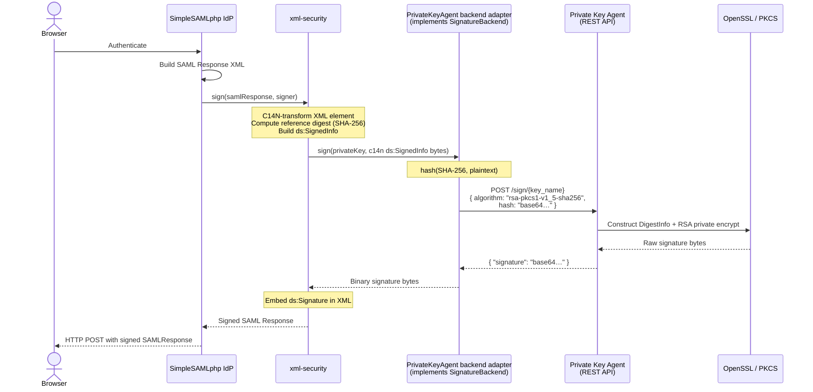
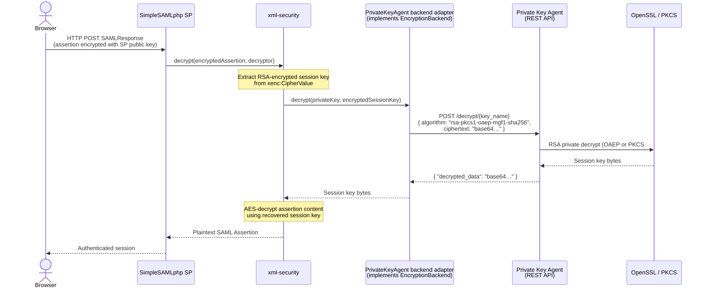

# OpenConext Private Key Agent

## Introduction

The Private Key Agent is a service that exposes a REST API for creating signatures and decrypting data using one or more private keys that it protects. It is designed to be used by other services that need to sign and decrypt data but do not want to handle the protection of private keys themselves. The agent runs in a separate process and user context, potentially on a different host, from the services that consume it.

The agent can be configured to use software keys, where the private key is stored in a file on disk, or hardware keys, where the private key is stored in a hardware security module (HSM) using PKCS#11. The REST API is identical regardless of the backend used.

The intended consumers are the SimpleSAMLphp xml-security backends:

- <https://github.com/simplesamlphp/xml-security/blob/master/src/Backend/SignatureBackend.php>
- <https://github.com/simplesamlphp/xml-security/blob/master/src/Backend/EncryptionBackend.php>

### SimpleSAML integration

SimpleSAMLphp uses the `simplesamlphp/xml-security` library for all cryptographic XML operations. The library defines two pluggable backend interfaces — `SignatureBackend` and `EncryptionBackend` — that decouple the XML-level processing from the underlying cryptographic operations. The default implementation is `OpenSSL`, which uses PHP's native OpenSSL extension and requires the private key to be in memory within the PHP process.

To use the Private Key Agent instead, a thin adapter class must be implemented for each interface. The adapters are registered with the `SignatureAlgorithmFactory` and `KeyTransportAlgorithmFactory` before any signing or decryption is attempted. Once registered, SimpleSAML's XML layer calls them transparently — no other changes to SimpleSAMLphp are required.

#### XML Signature (IdP signing a SAML Response)

When a SimpleSAMLphp IdP signs a SAML Response or Assertion, the following happens inside `xml-security`:

1. `SignableElementTrait::doSign()` applies the required XML canonicalization (C14N) transforms to the element being signed and computes the SHA digest of the result. This digest is embedded in a `ds:Reference` node.
2. The `ds:SignedInfo` structure is built and itself canonicalized. This canonicalized byte string is the **signing input**.
3. `AbstractSigner::sign()` is called with that byte string. It delegates to `SignatureBackend::sign($key, $plaintext)`.

The `PrivateKeyAgent` adapter implementing `SignatureBackend` must:

1. Compute `hash($digestAlgorithm, $plaintext)` locally — the agent API accepts a pre-computed hash, not raw plaintext.
2. Call `POST /sign/{key_name}` with the Base64-encoded hash and the algorithm identifier.
3. Return the binary signature bytes to xml-security, which embeds them in `ds:SignatureValue`.

The private key never leaves the agent. Only the hash value crosses the network boundary.

#### XML Encryption (SP decrypting an encrypted SAML Assertion)

When a SimpleSAMLphp SP decrypts an encrypted SAML Assertion, the XML contains an `xenc:CipherValue` holding a symmetric session key that was RSA-encrypted with the SP's public key. The `EncryptionBackend::decrypt($key, $ciphertext)` method receives the RSA-encrypted session key bytes.

The `PrivateKeyAgent` adapter implementing `EncryptionBackend` must:

1. Call `POST /decrypt/{key_name}` with the Base64-encoded ciphertext and the algorithm (`rsa-pkcs1-v1_5` or one of the OAEP variants).
2. Return the decrypted session key bytes to xml-security, which uses them to decrypt the assertion content with AES.

The symmetric session key and the assertion content are never sent to the agent.

#### Integration diagram





---

## Design Principles

The agent only performs private key operations. It does not process the actual message or data that needs to be signed or decrypted. When signing, the client sends a hash value and algorithm, and the agent constructs the DigestInfo ASN.1 structure internally and returns the signature. When decrypting, the agent only unwraps the encryption key. The rest of the signing and decryption processing is performed by the client.

This design keeps the agent simple, minimises the size of the REST API calls, and aligns with its primary goal: protecting private keys. XML documents, certificates, and other high-level data are never sent to the agent.

### Scope of access control

Each client can be allowed access to multiple private keys. More fine-grained access control, such as specifying which operations a client may perform on a key, is not implemented. This could be added later if needed. HSM backends may provide their own operation-level access control independently.

### Forward compatibility

Responses may include additional fields beyond those documented. Clients must ignore any unknown fields in the response to allow for future additions without breaking changes.

## Supported Operations

The following private key operations are supported, chosen because they are commonly used in SAML (xml-security):

- RSA PKCS#1 v1.5 signature (CKM_RSA_PKCS)
- RSA PKCS#1 v1.5 decryption (CKM_RSA_PKCS)
- RSA PKCS#1 OAEP decryption (CKM_RSA_PKCS_OAEP)

More key types (e.g. ECC) and operations can be added in the future.

### Design rationale for signing

A raw RSA operation was considered but rejected because it may conflict with existing HSM policies that forbid raw RSA operations, and it pushes all padding responsibility to the client. The chosen middle ground lets the client send the hash value and the hashing algorithm, while the agent constructs the DigestInfo structure and performs the PKCS#1 v1.5 signature internally.

### Design rationale for decryption

For RSA PKCS#1 v1.5 decryption, the agent returns the decrypted value (the symmetric key when used with `http://www.w3.org/2001/04/xmlenc#rsa-1_5`). The client uses this key to decrypt the actual data.

For RSA PKCS#1 OAEP decryption, additional parameters are needed: the MGF1 hash algorithm and an optional OAEP label. The label is not typically used in XML Encryption.

---

## Technology Stack

| Component | Choice |
|---|---|
| Language | PHP 8.5 |
| Framework | Symfony 7.4 |
| HTTP layer | Plain Symfony controllers |
| API documentation | NelmioApiDocBundle (OpenAPI) |
| PKCS#11 bridge | `gamringer/php-pkcs11` PHP extension |
| Logging | Monolog with JSON formatter to stdout |
| Testing | PHPUnit with mock interfaces |
| Deployment | Docker (PHP-FPM image + Caddy sidecar) |

> **PHP 8.5 is a hard requirement.** PHP 8.5 adds an optional `digest_algo` parameter to `openssl_private_decrypt()` and `openssl_public_encrypt()`, which is the only way to select the OAEP hash algorithm (SHA-256, SHA-384, SHA-512, etc.) when using the OpenSSL backend. Prior to PHP 8.5, `OPENSSL_PKCS1_OAEP_PADDING` hard-codes SHA-1 for both the hash and MGF1 hash, making the `rsa-pkcs1-oaep-mgf1-sha256/384/512` algorithm variants impossible to implement in the OpenSSL backend. Downgrading to PHP 8.4 would require restricting the OpenSSL backend to `rsa-pkcs1-oaep-mgf1-sha1` only.
>
> Verify during implementation that the `digest_algo` parameter controls both the OAEP hash and the MGF1 hash, and clarify whether an OAEP label can be passed through this API.

---

## REST API

### Authentication

All endpoints except `/health` and `/health/backend/{backend_name}` require a Bearer token in the `Authorization` header (RFC 6750). Tokens are matched against `client_secret` values in the configuration using `hash_equals()` to prevent timing attacks.

> **This is a static pre-shared bearer token scheme, not OAuth 2.0 client credentials.**
>
> The `client_secret` value in the configuration is the bearer token itself — the exact string the client places in the `Authorization: Bearer <value>` header. There is no token endpoint and no client credentials exchange. Compare with OAuth2, where `client_secret` is a credential submitted to a token endpoint to *obtain* an access token; here it is the access token.
>
> The config field name `client_secret` is intentionally retained to ease a future migration to OAuth2: in an OAuth2 setup, the `client_secret` would fulfil the same role (authenticating the client), but through a token endpoint rather than directly as a bearer token. When OAuth2 is added the authentication mechanism changes; the config field semantics stay consistent.
>
> The field `client_keys` is a list of logical **key names** (matching `backend_key_name` values) that the client is authorised to use. It is not a set of cryptographic keys or client certificates.

The intention is to make the agent usable in an OAuth 2.0 environment at a later date if needed.

### `POST /sign/{key_name}`

Signs a hash value using the specified key. The `key_name` path parameter must match `[a-zA-Z0-9_-]{1,64}`.

Request:

```
Authorization: Bearer <token>
Content-Type: application/json
```

```json
{
  "algorithm": "rsa-pkcs1-v1_5-sha256",
  "hash": "<Base64-encoded hash value>"
}
```

Supported algorithms: `rsa-pkcs1-v1_5-sha1`, `rsa-pkcs1-v1_5-sha256`, `rsa-pkcs1-v1_5-sha384`, `rsa-pkcs1-v1_5-sha512`

Response `200`:

```json
{
  "signature": "<Base64-encoded signature>"
}
```

### `POST /decrypt/{key_name}`

Decrypts ciphertext using the specified key. The `key_name` path parameter must match `[a-zA-Z0-9_-]{1,64}`.

Request:

```
Authorization: Bearer <token>
Content-Type: application/json
```

```json
{
  "algorithm": "rsa-pkcs1-v1_5",
  "encrypted_data": "<Base64-encoded ciphertext>",
  "label": "<Base64-encoded OAEP label, optional>"
}
```

Supported algorithms: `rsa-pkcs1-v1_5`, `rsa-pkcs1-oaep-mgf1-sha1`, `rsa-pkcs1-oaep-mgf1-sha224`, `rsa-pkcs1-oaep-mgf1-sha256`, `rsa-pkcs1-oaep-mgf1-sha384`, `rsa-pkcs1-oaep-mgf1-sha512`

The `label` field is only relevant for OAEP algorithms and is not typically used in XML Encryption.

Response `200`:

```json
{
  "decrypted_data": "<Base64-encoded decrypted data>"
}
```

### `GET /health`

No authentication required. Returns `200` if all backends are healthy, `500` otherwise.

Response `200`:

```json
{ "status": "OK" }
```

Response `500`:

```json
{
  "status": 500,
  "error": "server_error",
  "message": "One or more backends are unhealthy"
}
```

### `GET /health/backend/{backend_name}`

No authentication required. Returns `200` if the specified backend is healthy, `500` otherwise.

Response `200`:

```json
{ "status": "OK" }
```

Response `500`:

```json
{
  "status": 500,
  "error": "server_error",
  "message": "Backend is unhealthy"
}
```

Health check behaviour per backend type:

- **OpenSSL**: healthy if the key(s) loaded successfully at boot (checked statically, no runtime probe)
- **PKCS#11**: actively probed on each health request via `C_GetSessionInfo`

### Error Responses

All error responses follow RFC 6750 and use this JSON structure:

```json
{
  "status": 403,
  "error": "access_denied",
  "message": "Optional human-readable detail"
}
```

The HTTP status code in the response body must match the actual HTTP response status code.

On `401`, the response also includes the `WWW-Authenticate` header:

```
WWW-Authenticate: Bearer realm="<agent_name>", error="invalid_token", error_description="..."
```

| HTTP Status | Error Code | Cause |
|---|---|---|
| 400 | `invalid_request` | Missing or invalid request parameter |
| 401 | `invalid_token` | Missing or invalid bearer token |
| 403 | `access_denied` | Unknown key, unknown client, or client not permitted to use the key |
| 500 | `server_error` | Backend failure (OpenSSL or PKCS#11 error) |

---

## Configuration

### Loading

The agent configuration is loaded from a YAML file at runtime. The path is set via the `PRIVATE_KEY_AGENT_CONFIG` environment variable. The file is loaded during Symfony kernel boot. If the file is missing, unreadable, or invalid, the application fails fast — the PHP-FPM worker will not start and will log the error.

### Environment variable references

Sensitive values (`client_secret`, `backend_pkcs11_pin`, `backend_key_passphrase`) may be stored as plaintext or as Symfony environment variable references using the `%env(VAR)%` syntax.

### Example config file

```yaml
agent_name: my-private-key-agent

backends:
  - backend_name: software-backend
    backend_type: openssl
    keys:
      - backend_key_type: rsa
        backend_key_name: my-signing-key
        backend_key_operations: [sign, decrypt]
        backend_key_file: /etc/private-key-agent/keys/signing.pem
        backend_key_passphrase: '%env(SIGNING_KEY_PASSPHRASE)%'

  - backend_name: hsm-backend
    backend_type: pkcs11
    backend_pkcs11_lib: /usr/lib/softhsm/libsofthsm2.so
    backend_pkcs11_slot: 0
    backend_pkcs11_pin: '%env(HSM_PIN)%'
    backend_environment:
      SOFTHSM2_CONF: /etc/softhsm2.conf
    keys:
      - backend_key_type: rsa
        backend_key_name: my-signing-key
        backend_key_operations: [sign]
        backend_key_pkcs11_label: signing-key
      - backend_key_type: rsa
        backend_key_name: my-decryption-key
        backend_key_operations: [decrypt]
        backend_key_pkcs11_key_id: "01"

clients:
  - client_name: simplesamlphp
    client_secret: '%env(CLIENT_SSP_SECRET)%'
    client_keys:
      - my-signing-key
      - my-decryption-key
```

### Config Field Reference

#### Agent

- `agent_name`: The name of this agent. Used in `WWW-Authenticate` response headers as the `realm` value.

#### Backend

One or more backends can be defined. Each backend groups one or more private keys under a single backend type (OpenSSL or PKCS#11). When the same key name appears in multiple backends, the agent distributes requests across those backends round-robin — useful when the same key is available on multiple HSMs for performance or redundancy.

- `backend_name`: Unique name for the backend.
- `backend_type`: `openssl` or `pkcs11`.
- `backend_environment`: *(optional)* A map of environment variable names to values. These variables are set before the backend is initialised, allowing vendor-specific configuration (e.g. `SOFTHSM2_CONF`, `ChrystokiConfigurationPath`) to be co-located with the backend definition. Values support `%env(...)%` references.

PKCS#11-specific options:

- `backend_pkcs11_lib`: Path to the PKCS#11 shared library.
- `backend_pkcs11_slot`: PKCS#11 slot number.
- `backend_pkcs11_pin`: *(optional)* PIN to authenticate to the token. Supports `%env(...)%`.

#### Key

One or more keys can be configured under a backend.

- `backend_key_type`: `rsa`.
- `backend_key_name`: Name used by clients to refer to this key. Must match `[a-zA-Z0-9_-]{1,64}`. Must be unique within a backend. The same name may appear in multiple backends, in which case the agent distributes load round-robin across those backends. All keys sharing a name must be the same private key. This allows multiple HSMs to serve the same key for performance or redundancy.
- `backend_key_operations`: List of operations this key supports: `sign`, `decrypt`, or both (`[sign, decrypt]`). The registry only registers backends for the declared operations. Attempting an operation not listed returns `403 access_denied`. This is especially relevant for HSM keys where the token may enforce usage restrictions via `CKA_SIGN` / `CKA_DECRYPT` attributes.
- `backend_key_file`: *(openssl only)* Path to a PEM RSA PRIVATE KEY file.
- `backend_key_passphrase`: *(openssl, optional)* Passphrase for an encrypted PEM key file. Supports `%env(...)%`.
- `backend_key_pkcs11_label`: *(pkcs11)* `CKA_LABEL` of the key.
- `backend_key_pkcs11_key_id`: *(pkcs11)* `CKA_ID` of the key. At least one of label or key_id must be set. If both are set, both are used to find the key. Exactly one matching key must be found.

#### Client

- `client_name`: Name of the client. Used in logs for identification.
- `client_secret`: The bearer token the client sends in `Authorization: Bearer <value>`. This is the token itself, not an OAuth2 client secret used to obtain a token. Compared using `hash_equals()` to prevent timing attacks. Supports `%env(...)%`.
- `client_keys`: List of logical key names (matching `backend_key_name`) that this client is permitted to use. These are key identifiers, not cryptographic key material.

---

## Project Structure

```
/
├── bin/
│   └── console
├── config/
│   ├── packages/
│   │   ├── monolog.yaml
│   │   ├── nelmio_api_doc.yaml
│   │   └── security.yaml
│   ├── routes.yaml
│   └── services.yaml
├── docker/
│   ├── php-fpm/
│   │   └── Dockerfile
│   └── caddy/
│       └── Caddyfile
├── compose.yaml
├── src/
│   ├── Backend/
│   │   ├── SigningBackendInterface.php
│   │   ├── DecryptionBackendInterface.php
│   │   ├── DigestInfoBuilder.php
│   │   ├── OpenSsl/
│   │   │   ├── OpenSslSigningBackend.php
│   │   │   └── OpenSslDecryptionBackend.php
│   │   └── Pkcs11/
│   │       ├── Pkcs11SigningBackend.php
│   │       └── Pkcs11DecryptionBackend.php
│   ├── Command/
│   │   └── ValidateConfigCommand.php
│   ├── Config/
│   │   ├── AgentConfig.php
│   │   ├── BackendGroupConfig.php
│   │   ├── KeyConfig.php
│   │   ├── ClientConfig.php
│   │   └── ConfigLoader.php
│   ├── Controller/
│   │   ├── SignController.php
│   │   ├── DecryptController.php
│   │   └── HealthController.php
│   ├── Dto/
│   │   ├── SignRequest.php
│   │   └── DecryptRequest.php
│   ├── Exception/
│   │   ├── InvalidRequestException.php
│   │   ├── AuthenticationException.php
│   │   ├── AccessDeniedException.php
│   │   └── BackendException.php
│   ├── EventSubscriber/
│   │   └── ExceptionSubscriber.php
│   ├── Registry/
│   │   └── KeyRegistry.php
│   ├── Security/
│   │   ├── TokenAuthenticator.php
│   │   └── AccessControlService.php
│   └── Validator/
│       ├── Base64.php
│       └── Base64Validator.php
├── tests/
│   ├── Backend/
│   │   ├── OpenSsl/
│   │   │   ├── OpenSslSigningBackendTest.php
│   │   │   └── OpenSslDecryptionBackendTest.php
│   │   └── Pkcs11/
│   │       ├── Pkcs11SigningBackendTest.php
│   │       └── Pkcs11DecryptionBackendTest.php
│   ├── Controller/
│   │   ├── SignControllerTest.php
│   │   ├── DecryptControllerTest.php
│   │   └── HealthControllerTest.php
│   ├── Config/
│   │   └── ConfigLoaderTest.php
│   └── Security/
│       ├── TokenAuthenticatorTest.php
│       └── AccessControlServiceTest.php
└── composer.json
```

---

## Key Components

### `ConfigLoader`

- Reads the YAML file at the path from `PRIVATE_KEY_AGENT_CONFIG`.
- Resolves `%env(...)%` references.
- Throws on any error — no partial loading.
- Invoked during Symfony kernel boot via service constructor.

Performs the following explicit validations (throws `InvalidConfigurationException` on any failure, preventing worker start):

**Structural / required fields:**

- `agent_name`: required, non-empty string.
- At least one backend defined.
- `backend_name`: required per backend; **unique across all backends**.
- `backend_type`: required; must be `openssl` or `pkcs11`.
- At least one key defined per backend.
- `backend_key_type`: required; must be `rsa`.
- `backend_key_name`: required; must match `[a-zA-Z0-9_-]{1,64}`; **unique within its backend**.
- `backend_key_operations`: required; non-empty; each value must be `sign` or `decrypt`.
- OpenSSL: `backend_key_file` required.
- PKCS#11: `backend_pkcs11_lib` required; `backend_pkcs11_slot` required.
- PKCS#11 key: at least one of `backend_key_pkcs11_label` or `backend_key_pkcs11_key_id` must be set.
- At least one client defined.
- `client_name`: required; **unique across all clients**.
- `client_secret`: required; **must be non-empty** (an empty secret would authenticate blank-token requests — security issue).
- `client_keys`: required; non-empty list.

**Semantic / cross-reference checks:**

- Every entry in every client's `client_keys` must match a `backend_key_name` defined in at least one backend. An orphaned reference (key name configured for a client but not present in any backend) is a configuration error that would otherwise only surface as a confusing request-time 4xx/5xx. This check is done here rather than in `KeyRegistry` because it requires no open connections and is a pure config-level assertion.

> `ValidateConfigCommand` reuses `ConfigLoader` for all of the above, then additionally checks that OpenSSL key files exist and are readable on disk and that PKCS#11 library paths exist — resource checks that require filesystem access but no open sessions or key loads.

### `KeyRegistry`

- Initialised at boot from loaded config.
- Holds two separate maps: one for signing backends (key name → list of `SigningBackendInterface`) and one for decryption backends (key name → list of `DecryptionBackendInterface`).
- Provides `getSigningBackend(string $keyName): SigningBackendInterface` and `getDecryptionBackend(string $keyName): DecryptionBackendInterface` methods.
- Only registers backends for operations declared in `backend_key_operations`. If a key is not registered for the requested operation, the registry throws `AccessDeniedException`.
- Implements round-robin selection across backends for a given key name using a per-key counter.
- The counter is a static property (per PHP-FPM process); cross-process distribution is handled naturally by FPM.
- **Lazy key equivalence check**: on the first request for a given `key_name` that maps to multiple backends, asserts all `getPublicKeyFingerprint()` values are identical. Throws `InvalidConfigurationException` if any mismatch is detected, logging the offending key name and the differing fingerprints. This check is performed lazily inside the worker process, as PKCS#11 `C_Initialize` and session creation do not safely survive FPM's `fork()` from the master process.

### `TokenAuthenticator`

- Implements Symfony `AbstractAuthenticator`.
- Extracts the Bearer token from the `Authorization` header.
- Iterates configured clients and compares tokens using `hash_equals()`.
- Returns the matched `ClientConfig` as the authenticated user.
- Returns an RFC 6750-compliant 401 response when authentication fails.

### `AccessControlService`

- Called from `SignController` and `DecryptController` after authentication.
- Checks whether the authenticated client's `client_keys` list includes the requested `key_name`.
- Throws `AccessDeniedException` if not.

### `ExceptionSubscriber`

- Listens to `KernelEvents::EXCEPTION`.
- Maps domain exceptions to HTTP responses:
  - `InvalidRequestException` → 400
  - `AuthenticationException` → 401 + `WWW-Authenticate` header
  - `AccessDeniedException` → 403
  - `BackendException` → 500
  - Unhandled exceptions → 500

### Backend Interfaces

```php
interface BackendInterface
{
    /**
     * Returns true if the backend is operational (key loaded, HSM session alive, etc.).
     */
    public function isHealthy(): bool;

    /**
     * Returns a hex SHA-256 fingerprint derived solely from the RSA public key modulus.
     * Used lazily inside the worker or by CLI commands to verify that all backends sharing a key_name hold the same key.
     * The fingerprint is not secret and may be logged.
     */
    public function getPublicKeyFingerprint(): string;
}

interface SigningBackendInterface extends BackendInterface
{
    public function sign(string $algorithm, string $hash): string;
}

interface DecryptionBackendInterface extends BackendInterface
{
    public function decrypt(string $algorithm, string $encryptedData, ?string $label = null): string;
}
```

**`getPublicKeyFingerprint()` implementation per backend type:**

- **OpenSSL backends**: `hash('sha256', openssl_pkey_get_details($key)['rsa']['n'])` — `$key['rsa']['n']` is the binary modulus returned by `openssl_pkey_get_details()`.
- **PKCS#11 backends**: retrieve `CKA_MODULUS` via `$keyObject->getAttributeValue([Pkcs11\CKA_MODULUS])` and SHA-256 hash the raw bytes.

### `DigestInfoBuilder`

Shared utility (no state, static methods) used by both signing backends. Prepends the correct DER-encoded DigestInfo prefix for the given algorithm to the provided hash bytes, producing the structure that `openssl_private_encrypt()` / `C_Sign(CKM_RSA_PKCS)` expect.

The DER prefixes are well-known constants from RFC 3447 §9.2 / PKCS#1:

| Algorithm | Prefix (hex) | Hash length |
|---|---|---|
| SHA-1 | `3021300906052b0e03021a05000414` | 20 |
| SHA-256 | `3031300d060960864801650304020105000420` | 32 |
| SHA-384 | `3041300d060960864801650304020205000430` | 48 |
| SHA-512 | `3051300d060960864801650304020305000440` | 64 |

`DigestInfoBuilder` is unit-tested independently using hardcoded input/output pairs, in addition to being implicitly validated by the OpenSSL and PKCS#11 integration tests which verify signatures against the public key.

- Loads the PEM private key (with optional passphrase) at construction time.
- Constructs the DigestInfo ASN.1 structure internally by delegating to `DigestInfoBuilder`.
- Signs using `openssl_private_encrypt()` with `OPENSSL_PKCS1_PADDING` on the DigestInfo-wrapped hash.
- `isHealthy()` returns `true` if the key loaded successfully at boot.

### `OpenSslDecryptionBackend`

- Loads the PEM private key at construction time.
- Maps algorithm string to the appropriate `openssl_private_decrypt()` padding constant and `digest_algo` value (PHP 8.5+).
- For OAEP algorithms, passes the hash algorithm name via the `digest_algo` parameter added in PHP 8.5. Prior to PHP 8.5, only `rsa-pkcs1-oaep-mgf1-sha1` would be supportable with the OpenSSL backend.
- `isHealthy()` returns `true` if the key loaded successfully at boot.

### `Pkcs11SigningBackend`

- Lazily opens a PKCS#11 session on first use within the PHP-FPM worker using the configured library, slot, and PIN. This avoids `fork()` state corruption issues from the master process.
- Implements inline session recovery: catches session errors (`CKR_SESSION_CLOSED`, `CKR_DEVICE_REMOVED`, etc.), forces a re-initialization sequence, and retries the signing operation before giving up.
- Maps algorithm string to PKCS#11 mechanism and delegates DigestInfo construction to `DigestInfoBuilder` before calling `C_Sign` with `CKM_RSA_PKCS`.
- `isHealthy()` calls `C_GetSessionInfo` to verify the session is still valid (opening it first if needed).

### `Pkcs11DecryptionBackend`

- Lazily opens a PKCS#11 session on first use within the PHP-FPM worker. This avoids `fork()` state corruption issues from the master process.
- Implements inline session recovery: catches session errors, forces a re-initialization sequence, and retries the decryption operation before giving up.
- Maps algorithm string to PKCS#11 mechanism (e.g. `CKM_RSA_PKCS`, `CKM_RSA_PKCS_OAEP`).
- For OAEP algorithms, constructs `Pkcs11\RsaOaepParams` passing the hash algorithm, MGF1 algorithm, and optional label (source data) and bounds it to `Pkcs11\Mechanism`.
- `isHealthy()` calls `C_GetSessionInfo` (opening the session first if needed).

### `ValidateConfigCommand`

`bin/console private-key-agent:validate-config`

- Loads and validates the config file path from `PRIVATE_KEY_AGENT_CONFIG`.
- Checks all required fields.
- Verifies key files exist and are readable (OpenSSL backends).
- Verifies PKCS#11 library paths exist (PKCS#11 backends).
- Does not load keys or open HSM sessions.
- Exits with code 0 on success, 1 on failure with human-readable error output.

---

## Request DTO Validation

`#[Assert\Base64]` is a custom validation constraint (defined in `src/Validator/Base64.php` and `Base64Validator.php`). It validates that the value is a valid Base64-encoded string.

### `SignRequest`

```php
readonly class SignRequest
{
    #[Assert\NotBlank]
    #[Assert\Choice(['rsa-pkcs1-v1_5-sha1', 'rsa-pkcs1-v1_5-sha256', 'rsa-pkcs1-v1_5-sha384', 'rsa-pkcs1-v1_5-sha512'])]
    public string $algorithm;

    #[Assert\NotBlank]
    #[Assert\Base64]
    public string $hash;

    #[Assert\Callback]
    public function validateHashLength(ExecutionContextInterface $context): void
    {
        $expectedLengths = [
            'rsa-pkcs1-v1_5-sha1'   => 20,
            'rsa-pkcs1-v1_5-sha256' => 32,
            'rsa-pkcs1-v1_5-sha384' => 48,
            'rsa-pkcs1-v1_5-sha512' => 64,
        ];
        if (!isset($expectedLengths[$this->algorithm])) {
            return; // algorithm already fails #[Assert\Choice]
        }
        $decoded = base64_decode($this->hash, strict: true);
        if ($decoded === false || strlen($decoded) !== $expectedLengths[$this->algorithm]) {
            $context->buildViolation('hash must decode to {{ expected }} bytes for {{ algorithm }}.')
                ->setParameter('{{ expected }}', (string) $expectedLengths[$this->algorithm])
                ->setParameter('{{ algorithm }}', $this->algorithm)
                ->atPath('hash')
                ->addViolation();
        }
    }
}
```

### `DecryptRequest`

```php
readonly class DecryptRequest
{
    #[Assert\NotBlank]
    #[Assert\Choice(['rsa-pkcs1-v1_5', 'rsa-pkcs1-oaep-mgf1-sha1', 'rsa-pkcs1-oaep-mgf1-sha224', 'rsa-pkcs1-oaep-mgf1-sha256', 'rsa-pkcs1-oaep-mgf1-sha384', 'rsa-pkcs1-oaep-mgf1-sha512'])]
    public string $algorithm;

    #[Assert\NotBlank]
    #[Assert\Base64]
    #[SerializedName('encrypted_data')]
    public string $encryptedData;

    #[Assert\Base64]
    public ?string $label = null;

    #[Assert\Callback]
    public function validateCryptoConstraints(ExecutionContextInterface $context): void
    {
        // label is only meaningful for OAEP algorithms
        $oaepAlgorithms = ['rsa-pkcs1-oaep-mgf1-sha1', 'rsa-pkcs1-oaep-mgf1-sha224',
                           'rsa-pkcs1-oaep-mgf1-sha256', 'rsa-pkcs1-oaep-mgf1-sha384',
                           'rsa-pkcs1-oaep-mgf1-sha512'];
        if ($this->label !== null && !in_array($this->algorithm, $oaepAlgorithms, true)) {
            $context->buildViolation('label is only valid for OAEP algorithms.')
                ->atPath('label')
                ->addViolation();
        }

        // encrypted_data must decode to a plausible RSA ciphertext length (128–1024 bytes
        // covers RSA-1024 through RSA-8192; catches obviously malformed inputs early)
        $decoded = base64_decode($this->encryptedData, strict: true);
        if ($decoded !== false) {
            $len = strlen($decoded);
            if ($len < 128 || $len > 1024) {
                $context->buildViolation('encrypted_data must decode to 128–1024 bytes (RSA ciphertext range).')
                    ->atPath('encryptedData')
                    ->addViolation();
            }
        }
    }
}
```

> **Exact modulus-length check (backend responsibility):** The ciphertext must be exactly `modulus_bytes` long (e.g., 256 bytes for RSA-2048). This cannot be checked at DTO validation time because the key size is only known after the backend is resolved. Each decryption backend (`OpenSslDecryptionBackend`, `Pkcs11DecryptionBackend`) validates `strlen(ciphertext) === $this->getModulusBytes()` before attempting decryption and throws `InvalidRequestException` (→ 400) on mismatch, not `BackendException` (→ 500).

---

## Logging

Monolog with a JSON formatter writes to stdout (12-factor app). PHP-FPM error log goes to stderr.

| Level | Events |
|---|---|
| INFO | Each sign/decrypt request: client name, key name, algorithm |
| WARNING | Access denied, invalid token attempts |
| ERROR | Backend failures, config load failures |
| **Never logged** | Bearer tokens, key material, hash values, plaintext data, decrypted values |

---

## Composer Dependencies

```json
{
  "require": {
    "php": "^8.5",
    "symfony/framework-bundle": "^7.4",
    "symfony/security-bundle": "^7.4",
    "symfony/validator": "^7.4",
    "symfony/serializer": "^7.4",
    "symfony/yaml": "^7.4",
    "symfony/monolog-bundle": "^3.10",
    "symfony/console": "^7.4",
    "nelmio/api-doc-bundle": "^4.0"
  },
  "require-dev": {
    "phpunit/phpunit": "^11.0",
    "symfony/test-pack": "^1.0"
  }
}
```

The `gamringer/php-pkcs11` extension is installed as a system package in the Docker image, not via Composer.

---

## Docker

### PHP-FPM image (`docker/php-fpm/Dockerfile`)

- Base: `php:8.5-fpm-alpine`
- Install `gamringer/php-pkcs11` extension from source
- Install Composer dependencies
- Copy application source
- Run as non-root user
- Exposes port 9000 (FastCGI)

### Caddy sidecar (`docker/caddy/Caddyfile`)

- TLS termination
- `php_fastcgi` directive pointing to the PHP-FPM container on port 9000
- No rate limiting (operator responsibility)

### `compose.yaml`

Two services:

- `app`: PHP-FPM container, mounts config file and key files as read-only volumes, sets `PRIVATE_KEY_AGENT_CONFIG`.
- `caddy`: Caddy container, mounts Caddyfile, depends on `app`.

---

## HSM Communication in a Docker-Based Setup

### How communication works

The PKCS#11 architecture is **in-process**: the vendor-supplied shared library (`.so`) is loaded directly into the PHP-FPM worker by the `gamringer/php-pkcs11` extension using `dlopen`. There is no separate daemon or sidecar for HSM communication — function calls like `C_Sign` and `C_Decrypt` are plain C function calls into the library, which then handles the actual transport to the HSM.

This means the shared library and any vendor-specific client software it depends on must be present inside the PHP-FPM container. The library is either baked into the Docker image (for well-known open-source modules like SoftHSM2) or mounted from the host (for proprietary vendor libraries). The private key material never crosses the container boundary — it stays inside the HSM.

The transport between the library and the HSM depends on the physical form factor:

| HSM type | Transport | Docker requirement |
|---|---|---|
| Network HSM (Thales Luna Network, nShield Connect) | TCP/IP to the appliance on the network | Container needs network access (standard). Mount vendor client config and optionally a client certificate. |
| Cloud HSM (AWS CloudHSM, Azure Managed HSM) | TCP/IP to cloud endpoint | Container needs outbound internet/VPC access. Mount vendor client config and credentials. |
| USB HSM (YubiHSM 2, Nitrokey HSM 2) | USB to the host | Pass the USB device through to the container via `devices:` in `compose.yaml`. |
| PCIe HSM (Luna PCIe, nShield Solo) | PCIe via a host-side vendor daemon | Mount the Unix socket exposed by the vendor daemon using a `volumes:` bind mount. |

### Architecture diagram

```
┌─────────────────────────────────────────────────┐
│ Docker host                                     │
│                                                 │
│  ┌──────────────┐    ┌──────────────────────┐   │
│  │    Caddy     │    │   PHP-FPM (app)      │   │
│  │  (TLS term.) │    │                      │   │
│  │              │    │  PrivateKeyAgent     │   │
│  │              │───▶│  Pkcs11Backend       │   │
│  │              │    │       │              │   │
│  └──────────────┘    │  PKCS#11 .so library │   │
│                      │  (loaded in-process) │   │
│                      │       │              │   │
│                      └───────┼──────────────┘   │
│                              │                  │
│          ┌───────────────────┼──────────────┐   │
│          │ Transport (host)  │              │   │
│          │                   ▼              │   │
│          │  USB device  / Unix socket /     │   │
│          │  TCP to network or cloud HSM     │   │
│          └──────────────────────────────────┘   │
└─────────────────────────────────────────────────┘
                              │
        ┌─────────────────────▼──────────────────────┐
        │                    HSM                     │
        │  (physical appliance, USB token, or cloud) │
        │                                            │
        │  Private key stored and used here only.    │
        │  Cryptographic result returned; key never  │
        │  leaves the HSM boundary.                  │
        └────────────────────────────────────────────┘
```

### Example: network HSM (Thales Luna)

The vendor client package is installed in the Docker image. It includes the `.so` library and a configuration file (`Chrystoki.conf`) that specifies the appliance hostname and port. The container needs network access to the appliance and a mounted client certificate if mutual TLS is required.

```yaml
# compose.yaml (excerpt)
services:
  app:
    volumes:
      - /etc/Chrystoki.conf:/etc/Chrystoki.conf:ro
      - /etc/luna/cert:/etc/luna/cert:ro
    environment:
      PRIVATE_KEY_AGENT_CONFIG: /etc/private-key-agent/config.yaml
```

### Example: USB HSM (YubiHSM 2)

The YubiHSM 2 is connected to the host via USB. The PKCS#11 library communicates with it through the `yubihsm-connector` daemon running on the host, exposed as a Unix socket or local HTTP endpoint. Pass the socket or use the connector's default HTTP port.

```yaml
# compose.yaml (excerpt)
services:
  app:
    volumes:
      - /run/yubihsm-connector:/run/yubihsm-connector:ro
    environment:
      YUBIHSM_PKCS11_CONF: /etc/yubihsm_pkcs11.conf
      PRIVATE_KEY_AGENT_CONFIG: /etc/private-key-agent/config.yaml
```

### Example: SoftHSM2 (development / CI)

SoftHSM2 stores tokens as files on disk. The library and token directory are both inside the container (or mounted from the host). No USB passthrough or network access is required.

```yaml
# compose.yaml (excerpt)
services:
  app:
    volumes:
      - /var/lib/softhsm/tokens:/var/lib/softhsm/tokens:ro
    environment:
      SOFTHSM2_CONF: /etc/softhsm2.conf
      PRIVATE_KEY_AGENT_CONFIG: /etc/private-key-agent/config.yaml
```

---

## Testing Strategy

The test suite is split into three tiers, each with different infrastructure requirements.

### Unit tests

All services, controllers, authenticator, and exception subscriber are tested with PHPUnit using mock implementations of the backend interfaces. No cryptographic operations are performed and no HSM or OpenSSL key material is required. These tests run on any standard PHP environment and are always part of the main CI pipeline.

### OpenSSL integration tests

`OpenSslSigningBackend` and `OpenSslDecryptionBackend` are tested against real RSA private key operations. A test key pair is generated at the start of the test run using the OpenSSL CLI (no pre-existing key files needed). These tests verify the full signing and decryption paths through the OpenSSL backend, including correct DigestInfo construction, padding modes, and Base64 encoding of results. They have no external service dependencies and run in the main CI pipeline alongside the unit tests.

### PKCS#11 integration tests

`Pkcs11SigningBackend` and `Pkcs11DecryptionBackend` require a real PKCS#11 token to be present. **These tests cannot be mocked or faked** — because the PKCS#11 backend delegates all cryptographic operations to an external module via native library calls, only a real (or software-emulated) PKCS#11 token can exercise and validate the code.

For CI, **SoftHSM2** is used as a software HSM emulator. SoftHSM2 implements the full PKCS#11 API and behaves identically to physical hardware from the application's perspective. A Docker-based SoftHSM2 environment is provided and runs as a dedicated CI step, separate from the main pipeline.

The PKCS#11 integration tests cover:

- Session initialisation and PIN authentication
- Key lookup by `CKA_LABEL` and `CKA_ID`
- RSA PKCS#1 v1.5 signing (`CKM_RSA_PKCS`) for all supported hash algorithms, with verification of the resulting signature against the public key
- RSA PKCS#1 v1.5 decryption (`CKM_RSA_PKCS`)
- RSA OAEP decryption (`CKM_RSA_PKCS_OAEP`) for all supported MGF1 hash algorithms
- The `isHealthy()` probe via `C_GetSessionInfo`

> **Note on physical HSM validation**: The SoftHSM2-based CI tests validate the agent's PKCS#11 integration layer, but they do not substitute for testing against a physical HSM in staging before production deployment. Physical HSMs may enforce additional access policies, PIN lockout behaviour, and mechanism restrictions that SoftHSM2 does not replicate. A smoke test against the target HSM model should be performed as part of any production rollout.

---

## Performance Requirements

> **Status**: Target performance requirements have not yet been defined by stakeholders. This section describes the dimensions that must be specified, provides calculated throughput estimates based on the current architecture, and the decisions that will need to be made once concrete targets are available.

### Dimensions to define

| Dimension | Description | Why it matters |
|---|---|---|
| **Signing throughput** | Number of sign operations per second (sustained) | Determines PHP-FPM worker count and whether a single HSM is sufficient |
| **Decryption throughput** | Number of decrypt operations per second (sustained) | As above; decrypt is typically more expensive than signing on HSMs |
| **Peak load** | Maximum burst operations per second | Determines whether the FPM worker count and HSM session budget can absorb spikes |
| **Latency (p95 / p99)** | Acceptable response time for a single sign or decrypt call | Affects HSM selection; network appliances add round-trip overhead versus local PCIe/USB |
| **Availability** | Required uptime (e.g. 99.9%, 99.99%) | Determines whether HSM redundancy (multiple units / slots) is required |
| **Key count** | Number of distinct private keys the agent must serve | Affects HSM slot planning and session management |

### Architectural impact

**PHP-FPM concurrency** (`pm.max_children` in `php-fpm.conf`)

Each FPM worker holds one PKCS#11 session per configured PKCS#11 backend. The number of concurrent HSM operations the agent can perform equals `pm.max_children × number_of_pkcs11_backends`. Throughput and latency targets directly determine the required worker count. In a containerised deployment, horizontal scaling (multiple container replicas) multiplies this capacity at the cost of requiring more HSM sessions.

**HSM session limits**

Physical HSMs have a maximum number of concurrent sessions. For example, Thales Luna Network HSMs support hundreds to thousands of sessions depending on model and licence. YubiHSM 2 supports far fewer (around 16). If the worker count exceeds the HSM's session limit, sessions initialisation fails at boot. The session budget must be calculated as:

```
sessions_required = replicas × pm.max_children × pkcs11_backends_per_worker
```

**Round-trip latency**

For network and cloud HSMs, each `C_Sign` or `C_Decrypt` call includes a network round-trip to the HSM appliance or cloud endpoint. Under load this adds directly to p95/p99 latency. If latency targets are tight (e.g. < 20 ms), a local PCIe HSM or a low-latency network segment (same rack or availability zone) may be required. USB HSMs introduce USB bus latency and should only be considered for low-throughput use cases.

**HSM cryptographic throughput**

HSMs publish rated RSA operation throughputs (operations per second per key size). At 2048-bit RSA, enterprise appliances like Thales Luna Network reach thousands of operations per second. YubiHSM 2 is in the range of tens of operations per second for RSA. If throughput requirements exceed a single HSM's capacity, multiple HSM units can be used by adding multiple backends with the same `backend_key_name` — the agent distributes load round-robin across backends automatically.

**Redundancy and availability**

For availability targets above 99.9%, plan for at least two HSM units (or two cloud HSM instances). The agent's round-robin distribution across multiple backends with the same key name provides load distribution. To handle temporary disruptions (e.g., network blips to an HSM appliance), the agent implements **inline session recovery**. If a PKCS#11 operation fails with a session-related error (such as `CKR_SESSION_CLOSED` or `CKR_DEVICE_REMOVED`), the backend catches the error, re-initializes the session, re-authenticates with the PIN, and retries the operation once before failing the request.

If a failure persists and the backend reaches a hard error state, it returns a 500.

> **Single-worker PKCS#11 session failure is not detectable via the health endpoint alone.**
>
> In a multi-worker FPM deployment, health requests route randomly across workers. If only one worker's PKCS#11 session is persistently invalid despite recovery attempts, most health probes will land on healthy workers and return 200 — the degraded worker only surfaces as sporadic 500s on sign/decrypt requests.
>
> **Proposed solution:** Treat the health endpoint as a liveness signal for *boot-time* failures only. For runtime session failures, rely on error-rate monitoring:
>
> - Configure an alerting rule on the 5xx rate of the `/sign` and `/decrypt` endpoints (e.g. alert if p1m error rate exceeds 1%).
> - Set a short `pm.max_requests` value (e.g. 500–1000) so FPM periodically recycles workers, bounding how long a broken session can persist without a restart.
> - In Kubernetes, pair a liveness probe on `/health` (catches total boot failure) with a separate alert-driven remediation action (e.g. PagerDuty → manual pod restart or HPA scale event) for the sporadic-failure case.

### Estimated throughput

The following estimates are calculated from the per-request processing chain, based on the architecture described above: Caddy (TLS termination) → PHP-FPM (Symfony) → backend (OpenSSL or PKCS#11). All numbers assume RSA-2048 keys unless stated otherwise. RSA-4096 operations are roughly 4–5× slower for private key operations due to the cubic relationship between key size and modular exponentiation cost.

#### Calculation method

Each request passes through a fixed set of processing stages. The total per-request latency is the sum of all stages. Because PHP-FPM workers are synchronous (one request at a time per worker), the per-worker throughput is simply $\frac{1000}{\text{latency in ms}}$ operations per second. Total agent throughput scales linearly with the number of FPM workers (up to the backend's concurrency limit).

The estimates below are derived from published OpenSSL benchmarks (`openssl speed rsa2048` on modern x86-64 hardware), typical Symfony framework overhead for a minimal JSON API (no ORM, no template engine, opcache enabled), and documented HSM vendor specifications.

#### Per-request latency breakdown (RSA-2048)

**OpenSSL backend (software keys)**

| Stage | Duration | Notes |
|---|---|---|
| Caddy TLS + FastCGI proxy | ~0.3 ms | TLS session reuse; FastCGI over Unix socket or TCP |
| PHP-FPM request init | ~0.1 ms | Worker already running; no cold start |
| Symfony routing + security firewall | ~1.0 ms | TokenAuthenticator with `hash_equals()`, minimal firewall |
| JSON deserialization + validation | ~0.2 ms | Small payload (~100 bytes), two constraint checks |
| RSA private key operation | ~0.7 ms | `openssl_private_encrypt()` / `openssl_private_decrypt()`; includes DigestInfo construction for signing |
| JSON serialization + response | ~0.1 ms | Single Base64 field |
| **Total per request** | **~2.4 ms** | |

Per-worker throughput: $\frac{1000}{2.4} ≈ 400$ ops/sec

**PKCS#11 backend — network HSM (same datacenter, <1 ms network RTT)**

| Stage | Duration | Notes |
|---|---|---|
| Caddy TLS + FastCGI proxy | ~0.3 ms | Same as OpenSSL |
| PHP-FPM + Symfony overhead | ~1.3 ms | Same as OpenSSL |
| Network round-trip to HSM | ~0.5–2 ms | Depends on network topology; same-rack is fastest |
| HSM RSA operation | ~0.5–1 ms | Enterprise HSMs (Thales Luna, Entrust nShield) at 2048-bit |
| JSON serialization + response | ~0.1 ms | |
| **Total per request** | **~3–5 ms** | |

Per-worker throughput: $\frac{1000}{4} ≈ 250$ ops/sec (midpoint estimate)

**PKCS#11 backend — USB HSM (YubiHSM 2)**

| Stage | Duration | Notes |
|---|---|---|
| Caddy TLS + FastCGI + Symfony | ~1.7 ms | Same as above |
| USB transport + HSM crypto | ~25–50 ms | YubiHSM 2 RSA-2048 private key: ~20–40 ops/sec per device |
| **Total per request** | **~27–52 ms** | |

Per-worker throughput: $\frac{1000}{40} ≈ 25$ ops/sec (midpoint). The USB HSM is the bottleneck, not PHP.

#### Aggregate throughput by configuration

The table below shows estimated sustained throughput for common deployment configurations. The formula is:

$$\text{throughput} = \text{replicas} \times \text{pm.max\_children} \times \text{per-worker ops/sec}$$

This holds as long as the backend can sustain the load. For HSM backends, the HSM's own rated throughput is the ceiling regardless of how many FPM workers are configured.

| Backend | Workers | Replicas | Per-worker ops/sec | Aggregate ops/sec | Limiting factor |
|---|---|---|---|---|---|
| OpenSSL (RSA-2048) | 10 | 1 | ~400 | **~4,000** | CPU cores available to FPM |
| OpenSSL (RSA-2048) | 20 | 1 | ~400 | **~8,000** | CPU cores |
| OpenSSL (RSA-4096) | 10 | 1 | ~100 | **~1,000** | CPU (4–5× slower than 2048) |
| Network HSM (RSA-2048) | 10 | 1 | ~250 | **~2,500** | HSM throughput rating and network |
| Network HSM (RSA-2048) | 10 | 2 | ~250 | **~5,000** | HSM session limit |
| YubiHSM 2 (RSA-2048) | 10 | 1 | ~25 | **~250** | HSM crypto speed; max ~16 sessions |
| SoftHSM2 (RSA-2048) | 10 | 1 | ~350 | **~3,500** | CPU (comparable to OpenSSL) |

#### Realistic CPU constraint for OpenSSL

The per-worker throughput of ~400 ops/sec assumes the worker has a dedicated CPU core during its request. In practice, a container with 4 CPU cores running 10 FPM workers will see contention. As a rule of thumb, configure `pm.max_children` at 2× the available CPU cores for a CPU-bound workload like RSA signing. With 4 cores and 8 workers, expect ~3,200 ops/sec per replica — not the theoretical 8 × 400.

#### Signing versus decryption

For the OpenSSL backend, RSA signing and RSA PKCS#1 v1.5 decryption use the same underlying operation (modular exponentiation with the private exponent), so their performance is identical. RSA OAEP decryption adds negligible overhead for the OAEP unpadding step (~0.01 ms).

For HSM backends, signing and decryption throughput differences depend on the HSM firmware. Most enterprise HSMs rate them equally for the same key size. Consult the vendor datasheet for the specific model.

#### What these numbers do not include

- Client-side latency (network round-trip from the consuming service to Caddy).
- TLS handshake time for new connections (amortised over keep-alive connections; first request adds ~1–3 ms for TLS 1.3).
- Queue wait time when all FPM workers are busy (depends on load and arrival pattern).
- PHP garbage collection pauses (negligible for this workload; no large object graphs).

These estimates provide a baseline for capacity planning. It should be validated against the actual (deployment) environment with a load test.

### Sizing worksheet (to be completed once requirements are known)

| Parameter | Required value | Derived constraint |
|---|---|---|
| Signing ops/sec (sustained) | *TBD* | Minimum HSM throughput rating |
| Decryption ops/sec (sustained) | *TBD* | Minimum HSM throughput rating |
| p95 latency target | *TBD* | Maximum HSM network round-trip; local vs network HSM decision |
| Peak signing ops/sec | *TBD* | Minimum HSM throughput rating; FPM worker headroom |
| Availability target | *TBD* | Number of HSM units required |
| Container replicas | *TBD* | Total HSM session count = replicas × workers × backends |
| HSM session budget | *TBD* | Must be within HSM model's session limit |

### Recommended next step

Request the following before finalising the HSM model selection and infrastructure sizing:

1. Expected daily operation volume and peak operations per second
2. Latency requirement for SAML authentication flows (end-to-end and per sign/decrypt call)
3. Availability and disaster recovery requirements
4. Whether multiple data centres or cloud regions are in scope

---

## Compatible PKCS#11 Modules

Any PKCS#11 module that supports `CKM_RSA_PKCS` and `CKM_RSA_PKCS_OAEP` can be used with this agent. The following modules are known to be compatible.

### Software (development and testing)

| Module | PKCS#11 library path (typical) | Notes |
|---|---|---|
| SoftHSM2 | `/usr/lib/softhsm/libsofthsm2.so` | Free, open source software emulator by OpenDNSSEC. Recommended for development and CI. |

### On-premises hardware HSMs

| Vendor / Product | PKCS#11 library path (typical) | Notes |
|---|---|---|
| Thales Luna Network HSM / Luna PCIe | `/usr/safenet/lunaclient/lib/libCryptoki2_64.so` | Enterprise-grade, FIPS 140-2/3 Level 3. High throughput, high cost. |
| Entrust nShield Connect / nShield Solo | `/opt/nfast/toolkits/pkcs11/libcknfast.so` | Enterprise-grade, FIPS 140-2/3 Level 3. Formerly nCipher. |
| Utimaco SecurityServer / Se-Series | `/usr/lib/libcs_pkcs11_R2.so` | Enterprise HSM appliances and PCIe cards. FIPS 140-2 Level 3. |
| YubiHSM 2 | `/usr/lib/x86_64-linux-gnu/pkcs11/yubihsm_pkcs11.so` | USB form factor. Affordable (~$650). Suitable for lower-throughput deployments. |
| Nitrokey HSM 2 / SmartCard-HSM | via OpenSC: `/usr/lib/x86_64-linux-gnu/opensc-pkcs11.so` | Open hardware smart card HSM. Lowest cost physical option. Limited throughput. |

### Cloud HSM

| Provider | PKCS#11 library | Notes |
|---|---|---|
| AWS CloudHSM | `/opt/cloudhsm/lib/libcloudhsm_pkcs11.so` | Dedicated HSM cluster in your AWS VPC. FIPS 140-2 Level 3. |
| Azure Managed HSM | via PKCS#11 provider for Azure Key Vault | Cloud-managed, FIPS 140-2 Level 3. PKCS#11 support via third-party bridge. |

### Required PKCS#11 mechanisms

The agent requires the following mechanisms. Confirm your HSM supports them before deployment:

| Mechanism | Used for |
|---|---|
| `CKM_RSA_PKCS` | RSA PKCS#1 v1.5 signing and decryption |
| `CKM_RSA_PKCS_OAEP` | RSA OAEP decryption |

### Configuration note

Set `backend_pkcs11_lib` to the absolute path of the vendor-supplied shared library. Set `backend_pkcs11_slot` to the slot number assigned to your token (use the vendor's CLI tools to list available slots). For cloud HSMs, follow the vendor's documentation to install and configure their PKCS#11 client before running the agent.
