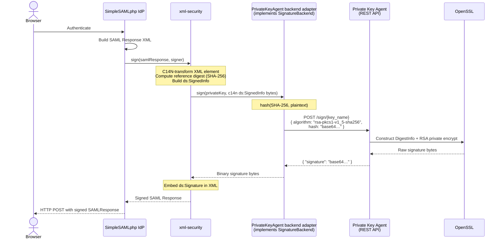
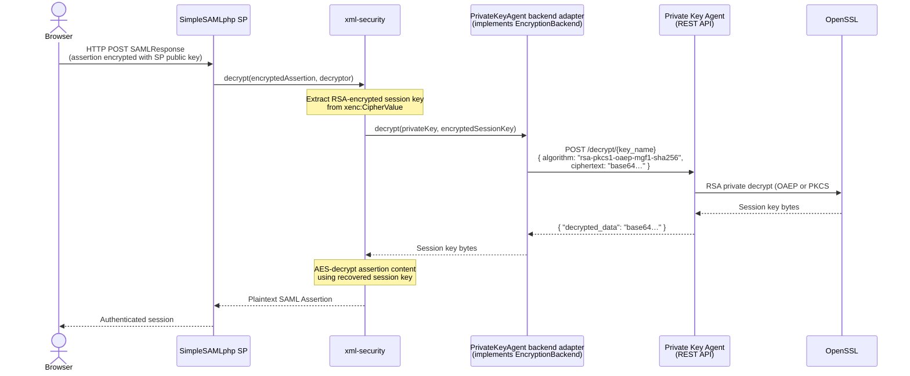
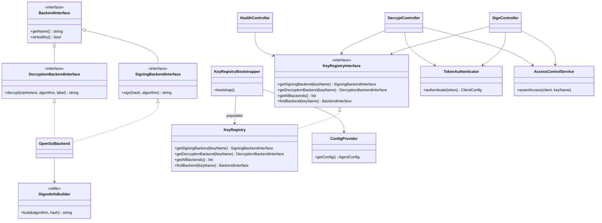

# OpenConext Private Key Agent Design Specification

**Project:** OpenConext Private-Key Agent  
**Date:** 2026-04-10  
**Version:** 1.0
**Author:** Martin Roest <martin.roest@dawn.tech>  

## Introduction

The Private Key Agent is a service that exposes a REST API for creating signatures and decrypting data using one or more private keys that it protects. It is designed to be used by other services that need to sign and decrypt data but do not want to handle the protection of private keys themselves. The agent runs in a separate process and user context, potentially on a different host, from the services that consume it.

The agent uses software keys stored as PEM files on disk. The REST API is identical regardless of the specific key material used.

The intended consumers are the SimpleSAMLphp xml-security backends:

- <https://github.com/simplesamlphp/xml-security/blob/master/src/Backend/SignatureBackend.php>
- <https://github.com/simplesamlphp/xml-security/blob/master/src/Backend/EncryptionBackend.php>

### SimpleSAML integration

SimpleSAMLphp uses the `simplesamlphp/xml-security` library for all cryptographic XML operations. The library defines two pluggable backend interfaces — `SignatureBackend` and `EncryptionBackend` — that decouple the XML-level processing from the underlying cryptographic operations. The default implementation is `OpenSSL`, which uses PHP's native OpenSSL extension and requires the private key to be in memory within the PHP process.

To use the Private Key Agent instead, a thin adapter class must be implemented for each interface. The adapters are registered with the `SignatureAlgorithmFactory` and `KeyTransportAlgorithmFactory` before any signing or decryption is attempted. Once registered, SimpleSAML's XML layer calls them transparently — no other changes to SimpleSAMLphp are required.

#### XML Signature (IdP signing a SAML Response)

When a SimpleSAMLphp IdP signs a SAML Response or Assertion, the following happens inside `xml-security`:

1. `SignableElementTrait::doSign()` applies the required XML canonicalization (C14N) transforms to the element being signed and computes the SHA digest of the result. This digest is embedded in a `ds:Reference` node.
2. The `ds:SignedInfo` structure is built and itself canonicalized. This canonicalized byte string is the **signing input**.
3. `AbstractSigner::sign()` is called with that byte string. It delegates to `SignatureBackend::sign($key, $plaintext)`.

The `PrivateKeyAgent` adapter implementing `SignatureBackend` must:

1. Compute `hash($digestAlgorithm, $plaintext)` locally — the agent API accepts a pre-computed hash, not raw plaintext.
2. Call `POST /sign/{key_name}` with the Base64-encoded hash and the algorithm identifier.
3. Return the binary signature bytes to xml-security, which embeds them in `ds:SignatureValue`.

The private key never leaves the agent. Only the hash value crosses the network boundary.

#### XML Encryption (SP decrypting an encrypted SAML Assertion)

When a SimpleSAMLphp SP decrypts an encrypted SAML Assertion, the XML contains an `xenc:CipherValue` holding a symmetric session key that was RSA-encrypted with the SP's public key. The `EncryptionBackend::decrypt($key, $ciphertext)` method receives the RSA-encrypted session key bytes.

The `PrivateKeyAgent` adapter implementing `EncryptionBackend` must:

1. Call `POST /decrypt/{key_name}` with the Base64-encoded ciphertext and the algorithm (`rsa-pkcs1-v1_5` or one of the OAEP variants).
2. Return the decrypted session key bytes to xml-security, which uses them to decrypt the assertion content with AES.

The symmetric session key and the assertion content are never sent to the agent.

#### Integration diagram





---

## Design Principles

The agent only performs private key operations. It does not process the actual message or data that needs to be signed or decrypted. When signing, the client sends a hash value and algorithm, and the agent constructs the DigestInfo ASN.1 structure internally and returns the signature. When decrypting, the agent only unwraps the encryption key. The rest of the signing and decryption processing is performed by the client.

This design keeps the agent simple, minimises the size of the REST API calls, and aligns with its primary goal: protecting private keys. XML documents, certificates, and other high-level data are never sent to the agent.

### Scope of access control

Each client can be allowed access to multiple private keys. More fine-grained access control, such as specifying which operations a client may perform on a key, is not implemented. This could be added later if needed.

### Forward compatibility

Responses may include additional fields beyond those documented. Clients must ignore any unknown fields in the response to allow for future additions without breaking changes.

## Supported Operations

The following private key operations are supported, chosen because they are commonly used in SAML (xml-security):

- RSA PKCS#1 v1.5 signature (CKM_RSA_PKCS)
- RSA PKCS#1 v1.5 decryption (CKM_RSA_PKCS)
- RSA PKCS#1 OAEP decryption (CKM_RSA_PKCS_OAEP)

More key types (e.g. ECC) and operations can be added in the future.

### Design rationale for signing

A raw RSA operation was considered but rejected because it pushes all padding responsibility to the client. The chosen middle ground lets the client send the hash value and the hashing algorithm, while the agent constructs the DigestInfo structure and performs the PKCS#1 v1.5 signature internally.

### Design rationale for decryption

For RSA PKCS#1 v1.5 decryption, the agent returns the decrypted value (the symmetric key when used with `http://www.w3.org/2001/04/xmlenc#rsa-1_5`). The client uses this key to decrypt the actual data.

For RSA PKCS#1 OAEP decryption, additional parameters are needed: the MGF1 hash algorithm and an optional OAEP label. The label is not typically used in XML Encryption.

---

## Technology Stack

| Component | Choice |
|---|---|
| Language | PHP 8.5 |
| Framework | Symfony 7.4 |
| HTTP layer | Plain Symfony controllers |
| API documentation | NelmioApiDocBundle (OpenAPI) |
| Logging | Monolog with JSON formatter to stdout |
| Testing | PHPUnit with mock interfaces |
| Deployment | Docker (Apache 2.4, `ghcr.io/openconext/openconext-basecontainers/php85-apache2`) |

> **PHP 8.5 is a hard requirement.** PHP 8.5 adds an optional `digest_algo` parameter to `openssl_private_decrypt()` and `openssl_public_encrypt()`, which is the only way to select the OAEP hash algorithm (SHA-256, SHA-384, SHA-512, etc.) when using the OpenSSL backend. Prior to PHP 8.5, `OPENSSL_PKCS1_OAEP_PADDING` hard-codes SHA-1 for both the hash and MGF1 hash, making the `rsa-pkcs1-oaep-mgf1-sha256/384/512` algorithm variants impossible to implement. Downgrading to PHP 8.4 would require restricting to `rsa-pkcs1-oaep-mgf1-sha1` only.
>
> Verify during implementation that the `digest_algo` parameter controls both the OAEP hash and the MGF1 hash, and clarify whether an OAEP label can be passed through this API.

---

## REST API

### Authentication

All endpoints except `/health` and `/health/key/{key_name}` require a Bearer token in the `Authorization` header (RFC 6750). Tokens are matched against `token` values in the configuration using `hash_equals()` to prevent timing attacks.

> **This is a static pre-shared bearer token scheme, not OAuth 2.0 client credentials.**
>
> The `token` value in the configuration is the bearer token itself — the exact string the client places in the `Authorization: Bearer <value>` header. There is no token endpoint and no client credentials exchange.
>
> The field `allowed_keys` is a list of logical **key names** (matching key `name` values) that the client is authorised to use. It is not a set of cryptographic keys or client certificates.

### `POST /sign/{key_name}`

Signs a hash value using the specified key. The `key_name` path parameter must match `[a-zA-Z0-9_-]{1,64}`.

Request:

```
Authorization: Bearer <token>
Content-Type: application/json
```

```json
{
  "algorithm": "rsa-pkcs1-v1_5-sha256",
  "hash": "<Base64-encoded hash value>"
}
```

Supported algorithms: `rsa-pkcs1-v1_5-sha1`, `rsa-pkcs1-v1_5-sha256`, `rsa-pkcs1-v1_5-sha384`, `rsa-pkcs1-v1_5-sha512`

Response `200`:

```json
{
  "signature": "<Base64-encoded signature>"
}
```

### `POST /decrypt/{key_name}`

Decrypts ciphertext using the specified key. The `key_name` path parameter must match `[a-zA-Z0-9_-]{1,64}`.

Request:

```
Authorization: Bearer <token>
Content-Type: application/json
```

```json
{
  "algorithm": "rsa-pkcs1-v1_5",
  "encrypted_data": "<Base64-encoded ciphertext>",
  "label": "<Base64-encoded OAEP label, optional>"
}
```

Supported algorithms: `rsa-pkcs1-v1_5`, `rsa-pkcs1-oaep-mgf1-sha1`, `rsa-pkcs1-oaep-mgf1-sha224`, `rsa-pkcs1-oaep-mgf1-sha256`, `rsa-pkcs1-oaep-mgf1-sha384`, `rsa-pkcs1-oaep-mgf1-sha512`

The `label` field is only relevant for OAEP algorithms and is not typically used in XML Encryption.

Response `200`:

```json
{
  "decrypted_data": "<Base64-encoded decrypted data>"
}
```

### `GET /health`

No authentication required. Returns `200` if all backends are healthy, `503` otherwise.

Response `200`:

```json
{ "status": "OK" }
```

Response `503`:

```json
{
  "status": 503,
  "error": "server_error",
  "message": "One or more backends are unhealthy",
  "unhealthy_keys": ["dev-signing-key"]
}
```

### `GET /health/key/{key_name}`

No authentication required. The `key_name` path parameter must match a configured key name.

Returns `200` if the named key's backend is healthy, `503` if unhealthy, `404` if no key with that name is registered.

Response `200`:

```json
{ "status": "OK", "key_name": "dev-signing-key" }
```

Response `503`:

```json
{
  "status": 503,
  "error": "server_error",
  "message": "Backend is unhealthy",
  "key_name": "dev-signing-key"
}
```

Response `404`:

```json
{
  "status": "not_found",
  "key_name": "unknown-name"
}
```

Health check behaviour: the OpenSSL backend returns `true` from `isHealthy()` if the key loaded successfully at boot (checked statically, no runtime probe).

### Error Responses

All error responses follow RFC 6750 and use this JSON structure:

```json
{
  "status": 403,
  "error": "access_denied",
  "message": "Optional human-readable detail"
}
```

The HTTP status code in the response body must match the actual HTTP response status code.

On `401`, the response also includes the `WWW-Authenticate` header:

```
WWW-Authenticate: Bearer realm="<agent_name>", error="invalid_token", error_description="..."
```

| HTTP Status | Error Code | Cause |
|---|---|---|
| 400 | `invalid_request` | Missing or invalid request parameter |
| 401 | `invalid_token` | Missing or invalid bearer token |
| 403 | `access_denied` | Client not permitted to use the key |
| 404 | `not_found` | Key not registered or operation not permitted for key |
| 500 | `server_error` | Backend failure (OpenSSL error) |

---

## Configuration

### Loading

The agent configuration is loaded from a YAML file at runtime. The path is set via the `PRIVATE_KEY_AGENT_CONFIG` environment variable. The file is loaded during Symfony kernel boot. If the file is missing, unreadable, or invalid, the application fails fast — the PHP process will not start and will log the error.

### Environment variable references

The path to the configuration file is read from the `PRIVATE_KEY_AGENT_CONFIG` environment variable, resolved by Symfony's DI container via `services.yaml`.

Values inside the config file (e.g. `token`) are plain strings — `ConfigLoader` uses `Symfony\Component\Yaml::parseFile()` directly and does **not** resolve `%env(...)%` references. Sensitive values must be supplied as plaintext strings or via a secrets management solution external to the agent (e.g. a mounted secrets file, Docker/Kubernetes secrets written to the config file on startup).

### Example config file

```yaml
agent_name: my-private-key-agent

keys:
  - name: my-signing-key
    key_path: /etc/private-key-agent/keys/signing.pem
    operations: [sign]

  - name: my-decryption-key
    key_path: /etc/private-key-agent/keys/decryption.pem
    operations: [decrypt]

clients:
  - name: simplesamlphp
    token: "bearer-token-value"
    allowed_keys:
      - my-signing-key
```

### Config Field Reference

#### Agent

- `agent_name`: The name of this agent. Used in `WWW-Authenticate` response headers as the `realm` value.

#### Keys

Each entry in `keys` defines a logical key identity backed by a single PEM file. Clients reference keys by name. The `operations` list controls which cryptographic operations are permitted for this key.

- `name`: Logical key name. Used by clients in the request `key_name` field and in `allowed_keys`. Must be unique and match `[a-zA-Z0-9_-]{1,64}`.
- `key_path`: Path to a PEM private key file. Only RSA keys are supported; the backend validates at startup that the loaded key is RSA and throws a `BackendException` otherwise.
- `operations`: Non-empty list of permitted operations for this key. Valid values: `sign`, `decrypt`.

#### Client

- `name`: Name of the client. Used in logs for identification.
- `token`: The bearer token the client sends in `Authorization: Bearer <value>`. This is the token itself, not an OAuth2 client secret used to obtain a token. Compared using `hash_equals()` to prevent timing attacks.
- `allowed_keys`: List of logical key names (matching key `name` values) that this client is permitted to use. Use `["*"]` to grant access to all configured keys.

---

## Project Structure

### Folder Layout

| Directory | Purpose |
|---|---|
| `bin/` | Symfony console entry point (`bin/console`) |
| `config/` | Symfony configuration: routing, service wiring, and package configs (monolog, nelmio, security) |
| `docker/` | Docker build artefacts: multi-stage `Dockerfile` and PHP ini files |
| `public/` | Web root: `index.php` (Apache entry point) |
| `src/Backend/` | OpenSSL backend implementation and backend interfaces |
| `src/Command/` | Symfony console commands; currently `ValidateConfigCommand` for offline configuration validation |
| `src/Config/` | Configuration loading (`ConfigLoader`, `ConfigProvider`) and immutable value objects for agent, key, and client configuration |
| `src/Controller/` | REST API controllers: `SignController`, `DecryptController`, `HealthController` |
| `src/Crypto/` | Low-level cryptographic utilities; currently `DigestInfoBuilder` (DER-encodes the DigestInfo ASN.1 structure for PKCS#1 v1.5 signing) |
| `src/Dto/` | Request data transfer objects (`SignRequest`, `DecryptRequest`) with Symfony validation constraints |
| `src/EventSubscriber/` | `ExceptionSubscriber` maps domain exceptions to RFC 6750 HTTP error responses |
| `src/Exception/` | Domain exception hierarchy (`AuthenticationException`, `AccessDeniedException`, `BackendException`, `InvalidRequestException`, `InvalidConfigurationException`) |
| `src/Security/` | Authentication (`TokenAuthenticator`) and key-level access control (`AccessControlService`) |
| `src/Service/` | Key registry (`KeyRegistry`, `KeyRegistryBootstrapper`, `KeyRegistryInterface`) — maps logical key names to backend instances |
| `src/Validator/` | Custom Symfony validation constraint (`Base64`, `Base64Validator`) |
| `tests/Unit/` | Unit tests using mocks; no I/O or cryptographic operations required |
| `tests/Integration/` | Integration tests for the OpenSSL backends against real key material |
| `tools/` | Operator scripts (smoke test endpoint script) |
| `var/` | Symfony runtime cache and logs (excluded from VCS) |

### Key Class Overview

The diagram below shows the main classes and their relationships. Configuration value objects are omitted for clarity; they are described individually in the [Key Components](#key-components) section below.



---

## Key Components

### `ConfigProvider`

Thin singleton wrapper around `ConfigLoader`. Receives the config file path via Symfony DI as `$configPath: '%env(string:PRIVATE_KEY_AGENT_CONFIG)%'` (resolved from the `PRIVATE_KEY_AGENT_CONFIG` environment variable at container boot). Calls `ConfigLoader::load()` on first access and caches the result.

### `ConfigLoader`

- Reads the YAML file at the path provided by `ConfigProvider` (which receives it from `PRIVATE_KEY_AGENT_CONFIG` via Symfony DI).
- Throws on any error — no partial loading.
- Invoked during Symfony kernel boot via service constructor.

Performs the following explicit validations (throws `InvalidConfigurationException` on any failure, preventing worker start):

**Structural / required fields:**

- `agent_name`: required, non-empty string.
- At least one key defined in `keys`.
- `name`: required per key; must match `[a-zA-Z0-9_-]{1,64}`; **unique within keys**.
- `key_path`: required per key.
- `operations`: required per key; non-empty list; each value must be `sign` or `decrypt`.
- At least one client defined in `clients`.
- `name`: required per client; **unique across all clients**.
- `token`: required; **must be non-empty** (an empty token would authenticate blank-token requests — security issue).
- `allowed_keys`: required; non-empty list.

> `ValidateConfigCommand` reuses `ConfigLoader` for all of the above. Successful parsing means the config is structurally valid; it does not open key files or validate key accessibility.

> **RSA-only enforcement:** Only RSA private keys are currently supported. The OpenSSL backend validates this at construction time (checking for an RSA modulus in the key details). A non-RSA key causes immediate failure with a `BackendException`.

### `KeyRegistry` / `KeyRegistryBootstrapper`

- `KeyRegistryBootstrapper` is invoked at boot and populates `KeyRegistry` by reading `KeyConfig` objects from `AgentConfig`. For each key, it creates an `OpenSslBackend` instance and registers it with the allowed operations.
- `KeyRegistry` holds a single map of key name → `OpenSslBackend` and a map of key name → permitted operations.
- Provides `getSigningBackend(string $keyName): SigningBackendInterface` and `getDecryptionBackend(string $keyName): DecryptionBackendInterface` methods.
- If a key name is not registered, or is not registered for the requested operation, the registry throws `KeyNotFoundException` (→ 404).

### `TokenAuthenticator`

- Implements the custom `AuthenticatorInterface` (not Symfony's `AbstractAuthenticator`).
- Is a plain Symfony service; controllers call `$this->authenticator->authenticate($token)` directly, bypassing the Symfony Security firewall.
- Extracts the Bearer token from the `Authorization` header.
- Iterates configured clients and compares tokens using `hash_equals()`.
- Returns the matched `ClientConfig` as the authenticated entity.
- Throws `AuthenticationException` (→ 401 with `WWW-Authenticate` header) when authentication fails.

### `AccessControlService`

- Called from `SignController` and `DecryptController` after authentication.
- Checks whether the authenticated client's `allowed_keys` list includes the requested `key_name`.
- Throws `AccessDeniedException` if not.

### `ExceptionSubscriber`

- Listens to `KernelEvents::EXCEPTION`.
- Maps domain exceptions to HTTP responses:
  - `InvalidRequestException` → 400
  - `AuthenticationException` → 401 + `WWW-Authenticate` header
  - `AccessDeniedException` → 403
  - `KeyNotFoundException` → 404
  - `BackendException` → 500
  - Unhandled exceptions → 500

### Backend Interfaces

```php
interface BackendInterface
{
    /**
     * Returns the backend group name (as configured in YAML).
     */
    public function getName(): string;

    /**
     * Returns true if the backend is operational (key loaded successfully, etc.).
     */
    public function isHealthy(): bool;

    /**
     * Returns a hex SHA-256 fingerprint derived solely from the RSA public key modulus.
     * Used lazily to verify that all backends sharing a key_name hold the same key.
     * The fingerprint is not secret and may be logged.
     */
### Backend Interfaces

```php
interface BackendInterface
{
    /**
     * Returns the key name (as configured in YAML).
     */
    public function getName(): string;

    /**
     * Returns true if the backend is operational (key loaded successfully, etc.).
     */
    public function isHealthy(): bool;
}

interface SigningBackendInterface extends BackendInterface
{
    public function sign(string $hash, string $algorithm): string;
}

interface DecryptionBackendInterface extends BackendInterface
{
    public function decrypt(string $ciphertext, string $algorithm, string|null $label = null): string;
}
```

### `OpenSslBackend`

- Loads the PEM private key at construction time; throws `BackendException` immediately if the key is invalid or not RSA.
- Implements both `SigningBackendInterface` and `DecryptionBackendInterface`.
- Signing: delegates to `DigestInfoBuilder` to prepend the DER-encoded DigestInfo prefix, then calls `openssl_private_encrypt()` with `OPENSSL_PKCS1_PADDING`.
- Decryption: maps algorithm string to the appropriate `openssl_private_decrypt()` padding constant and optional `digest_algo` value (PHP 8.5+). For OAEP algorithms, passes the hash algorithm name via `digest_algo` (PHP 8.5+).
- `isHealthy()` returns `true` if the key loaded successfully at boot.

### `ValidateConfigCommand`

`bin/console app:validate-config <config-path>`

- Accepts a required `config-path` CLI argument.
- Loads and validates the config file by calling `ConfigLoader::load($path)`.
- Checks all required fields and semantic cross-references (see `ConfigLoader` section).
- Does not check whether OpenSSL key files exist on disk, and does not open key files or validate key accessibility.
- Exits with code 0 on success, 1 on failure with human-readable error output.

---

## Request DTO Validation

`#[Assert\Base64]` is a custom validation constraint (defined in `src/Validator/Base64.php` and `Base64Validator.php`). It validates that the value is a valid Base64-encoded string.

### `SignRequest`

```php
final class SignRequest
{
    public const array ALGORITHMS = [
        'rsa-pkcs1-v1_5-sha1',
        'rsa-pkcs1-v1_5-sha256',
        'rsa-pkcs1-v1_5-sha384',
        'rsa-pkcs1-v1_5-sha512',
    ];

    private const array HASH_LENGTHS = [
        'rsa-pkcs1-v1_5-sha1'   => 20,
        'rsa-pkcs1-v1_5-sha256' => 32,
        'rsa-pkcs1-v1_5-sha384' => 48,
        'rsa-pkcs1-v1_5-sha512' => 64,
    ];

    #[Assert\NotBlank]
    #[Assert\Choice(choices: self::ALGORITHMS, message: 'Invalid signing algorithm.')]
    public string $algorithm = '';

    #[Assert\NotBlank]
    #[Assert\Base64]
    public string $hash = '';

    #[Assert\Callback]
    public function validateHashLength(ExecutionContextInterface $context): void
    {
        if (!in_array($this->algorithm, self::ALGORITHMS, true)) {
            return; // algorithm already fails #[Assert\Choice]
        }
        if ($this->hash === '') {
            return; // NotBlank will handle this
        }
        $decoded = base64_decode($this->hash, strict: true);
        if ($decoded === false) {
            return; // Base64 validator will handle this
        }
        $expectedLength = self::HASH_LENGTHS[$this->algorithm];
        $actualLength   = strlen($decoded);
        if ($actualLength === $expectedLength) {
            return;
        }
        $context->buildViolation(sprintf(
            'Hash length %d bytes does not match expected %d bytes for %s.',
            $actualLength,
            $expectedLength,
            $this->algorithm,
        ))
            ->atPath('hash')
            ->addViolation();
    }
}
```

### `DecryptRequest`

```php
final class DecryptRequest
{
    public const array ALGORITHMS = [
        'rsa-pkcs1-v1_5',
        'rsa-pkcs1-oaep-mgf1-sha1',
        'rsa-pkcs1-oaep-mgf1-sha224',
        'rsa-pkcs1-oaep-mgf1-sha256',
        'rsa-pkcs1-oaep-mgf1-sha384',
        'rsa-pkcs1-oaep-mgf1-sha512',
    ];

    private const array OAEP_ALGORITHMS = [
        'rsa-pkcs1-oaep-mgf1-sha1',
        'rsa-pkcs1-oaep-mgf1-sha224',
        'rsa-pkcs1-oaep-mgf1-sha256',
        'rsa-pkcs1-oaep-mgf1-sha384',
        'rsa-pkcs1-oaep-mgf1-sha512',
    ];

    #[Assert\NotBlank]
    #[Assert\Choice(choices: self::ALGORITHMS, message: 'Invalid decryption algorithm.')]
    public string $algorithm = '';

    #[Assert\NotBlank]
    #[Assert\Base64]
    #[SerializedName('encrypted_data')]
    public string $encryptedData = '';

    #[Assert\Base64]
    public string|null $label = null;

    #[Assert\Callback]
    public function validateRequest(ExecutionContextInterface $context): void
    {
        // encrypted_data must decode to a plausible RSA ciphertext length (128–1024 bytes
        // covers RSA-1024 through RSA-8192; catches obviously malformed inputs early)
        if ($this->encryptedData !== '') {
            $decoded = base64_decode($this->encryptedData, strict: true);
            if ($decoded !== false) {
                $len = strlen($decoded);
                if ($len < 128 || $len > 1024) {
                    $context->buildViolation(sprintf(
                        'Encrypted data must be 128-1024 bytes, got %d bytes.',
                        $len,
                    ))
                        ->atPath('encryptedData')
                        ->addViolation();
                }
            }
        }

        // label is only meaningful for OAEP algorithms
        if ($this->label === null || in_array($this->algorithm, self::OAEP_ALGORITHMS, true)) {
            return;
        }
        $context->buildViolation('Label is only allowed for OAEP algorithms.')
            ->atPath('label')
            ->addViolation();
    }
}
```

> **Exact modulus-length check (backend responsibility):** The ciphertext must be exactly `modulus_bytes` long (e.g., 256 bytes for RSA-2048). This cannot be checked at DTO validation time because the key size is only known after the backend is resolved. Each decryption backend (`OpenSslDecryptionBackend`) validates `strlen(ciphertext) === $this->getModulusBytes()` before attempting decryption and throws `InvalidRequestException` (→ 400) on mismatch, not `BackendException` (→ 500).

---

## Logging

Monolog with a JSON formatter writes to stdout (12-factor app). The log level is controlled by the `LOG_LEVEL` environment variable (default: `info`). Apache's own access log also goes to stdout.

| Level | Events |
|---|---|
| INFO | Each sign/decrypt request: client name, key name, algorithm |
| WARNING | Access denied, invalid token attempts |
| ERROR | Backend failures, config load failures |
| **Never logged** | Bearer tokens, key material, hash values, plaintext data, decrypted values |

---

## Composer Dependencies

```json
{
  "require": {
    "php": "^8.5",
    "nelmio/api-doc-bundle": "^4.0",
    "symfony/console": "^7.4",
    "symfony/framework-bundle": "^7.4",
    "symfony/monolog-bundle": "^3.10",
    "symfony/property-access": "^7.4",
    "symfony/runtime": "^7.4",
    "symfony/security-bundle": "^7.4",
    "symfony/serializer": "^7.4",
    "symfony/validator": "^7.4",
    "symfony/yaml": "^7.4"
  },
  "require-dev": {
    "doctrine/coding-standard": "^14.0",
    "overtrue/phplint": "^9.7",
    "phpstan/extension-installer": "^1.4",
    "phpstan/phpstan": "^2.1",
    "phpstan/phpstan-phpunit": "^2.0",
    "phpstan/phpstan-symfony": "^2.0",
    "phpunit/phpunit": "^11.0",
    "squizlabs/php_codesniffer": "^4.0",
    "symfony/dotenv": "^8.0",
    "symfony/test-pack": "^1.0"
  }
}
```

---

## Docker

### Multi-stage `docker/Dockerfile`

Four stages:

- **`vendor`**: `composer:2` image. Installs production Composer dependencies (`--no-dev`) into `/var/www/html/vendor`. Running `composer install` here avoids the need for `zip`/`git` tooling in the runtime image.
- **`vendor-dev`**: `composer:2` image. Installs all Composer dependencies (including dev) into `/var/www/html/vendor`. Used exclusively by the `dev` stage.
- **`prod`**: `ghcr.io/openconext/openconext-basecontainers/php85-apache2` (Debian, PHP 8.5 with Apache 2.4). Copies the vendor directory from `vendor`, copies application source, generates an optimised classmap autoloader, installs PHP OPcache settings from `docker/app.ini`, deploys the Apache vhost from `docker/apache-app.conf`, and pre-warms the Symfony cache (`APP_DEBUG=0`). The web root is `/var/www/html`.
- **`dev`**: Extends `prod`. Replaces the vendor directory with the one from `vendor-dev` (adds dev dependencies) and regenerates the autoloader. Used by `compose.yaml`.

### PHP configuration (`docker/app.ini`)

OPcache and PHP runtime settings are stored in `docker/app.ini` instead of being generated inline in the Dockerfile. The file is `COPY`'d into the production image and volume-mounted from the host in `compose.yaml`, making it easy to tune settings without rebuilding.

### `compose.yaml`

The compose file is intended for development. Single service:

- `app`: Apache+PHP container (`dev` stage), mounts the application source tree under `/var/www/html`, config file, and `docker/app.dev.ini` as read-only volumes. Exposes port 80. The `PRIVATE_KEY_AGENT_CONFIG` environment variable must be supplied via a `.env` file or shell environment.

---

## Testing Strategy

The test suite is split into two directories with different infrastructure requirements.

### Unit tests (`tests/Unit/`)

All services, controllers, authenticator, exception subscriber, DTOs, config loader, command, and validators are tested with PHPUnit using mocks or pure PHP. No cryptographic operations are performed and no key material is required. These tests run on any standard PHP environment and are always part of the main CI pipeline.

Unit test coverage includes: `BackendFactory`, `OpenSslBackendTypeFactory`, `ValidateConfigCommand`, `ConfigLoader`, `DecryptController`, `HealthController`, `SignController`, `DigestInfoBuilder`, `DecryptRequest`, `SignRequest`, `ExceptionSubscriber`, `AccessControlService`, `TokenAuthenticator`, `KeyRegistryBootstrapper`, `KeyRegistry`, `Base64Validator`.

### Integration tests (`tests/Integration/`)

`OpenSslSigningBackend` and `OpenSslDecryptionBackend` are tested against real RSA private key operations.

These tests have no external dependencies — a test key pair is generated at the start of the test run. They run in the main CI pipeline alongside the unit tests.

The OpenSSL integration tests cover:

- Key loading and validation
- RSA PKCS#1 v1.5 signing for all supported hash algorithms, with verification of the resulting signature against the public key
- RSA PKCS#1 v1.5 decryption
- RSA OAEP decryption for all supported MGF1 hash algorithms
- The `isHealthy()` probe

---

## Performance Requirements

> **Status**: Target performance requirements have not yet been defined by stakeholders. This section describes the dimensions that must be specified, provides calculated throughput estimates based on the current architecture, and the decisions that will need to be made once concrete targets are available.

### Dimensions to define

| Dimension | Description | Why it matters |
|---|---|---|
| **Signing throughput** | Number of sign operations per second (sustained) | Determines Apache worker count |
| **Decryption throughput** | Number of decrypt operations per second (sustained) | As above; decrypt and signing are equivalent for RSA |
| **Peak load** | Maximum burst operations per second | Determines whether the worker count can absorb spikes |
| **Latency (p95 / p99)** | Acceptable response time for a single sign or decrypt call | Affects worker count and horizontal scaling decisions |
| **Availability** | Required uptime (e.g. 99.9%, 99.99%) | Determines whether multiple replicas are required |
| **Key count** | Number of distinct private keys the agent must serve | Affects memory footprint and key management |

### Estimated throughput (OpenSSL backend)

The following estimates are derived from published OpenSSL benchmarks (`openssl speed rsa2048` on modern x86-64 hardware), typical Symfony framework overhead for a minimal JSON API (no ORM, no template engine, OPcache enabled). All numbers assume RSA-2048 keys unless stated otherwise. RSA-4096 operations are roughly 4–5× slower for private key operations due to the cubic relationship between key size and modular exponentiation cost.

#### Per-request latency breakdown (RSA-2048)

| Stage | Duration | Notes |
|---|---|---|
| Apache request dispatch | ~0.2 ms | mod_php: PHP executes directly within the Apache worker process; no IPC overhead |
| Symfony routing + security firewall | ~1.0 ms | TokenAuthenticator with `hash_equals()`, minimal firewall |
| JSON deserialization + validation | ~0.2 ms | Small payload (~100 bytes), two constraint checks |
| RSA private key operation | ~0.7 ms | `openssl_private_encrypt()` / `openssl_private_decrypt()`; includes DigestInfo construction for signing |
| JSON serialization + response | ~0.1 ms | Single Base64 field |
| **Total per request** | **~2.2 ms** | |

Approximate per-worker throughput: ~450 ops/sec.

#### Aggregate throughput by configuration

| Workers | Replicas | Per-worker ops/sec | Aggregate ops/sec | Limiting factor |
|---|---|---|---|---|
| 10 | 1 | ~400 | **~4,000** | CPU cores available |
| 20 | 1 | ~400 | **~8,000** | CPU cores |
| 10 | 1 | ~100 | **~1,000** | CPU (RSA-4096, 4–5× slower than 2048) |

#### CPU constraint

The per-worker throughput of ~400 ops/sec assumes the worker has a dedicated CPU core during its request. In practice, a container with 4 CPU cores running 10 Apache workers will see contention. As a rule of thumb, configure the worker count at 2× the available CPU cores for a CPU-bound workload like RSA signing. With 4 cores and 8 workers, expect ~3,200 ops/sec per replica.

#### Signing versus decryption

For the OpenSSL backend, RSA signing and RSA PKCS#1 v1.5 decryption use the same underlying operation (modular exponentiation with the private exponent), so their performance is identical. RSA OAEP decryption adds negligible overhead for the OAEP unpadding step (~0.01 ms).

#### What these numbers do not include

- Client-side latency (network round-trip from the consuming service to Apache).
- TLS handshake time for new connections (amortised over keep-alive connections if TLS is terminated upstream).
- Queue wait time when all Apache workers are busy (depends on load and arrival pattern).
- PHP garbage collection pauses (negligible for this workload; no large object graphs).

These estimates provide a baseline for capacity planning. Validate against the actual deployment environment with a load test.
