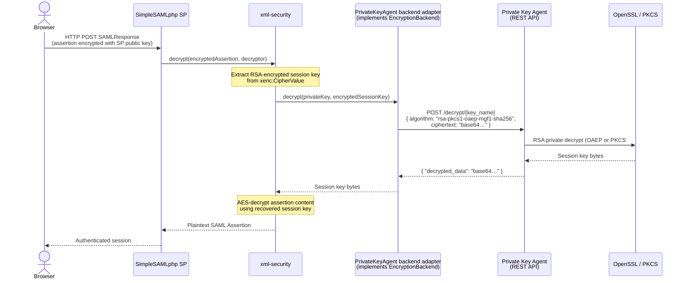
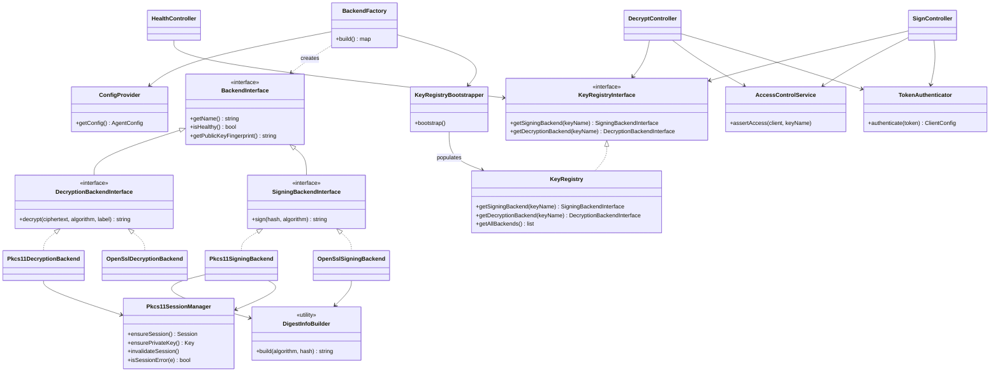
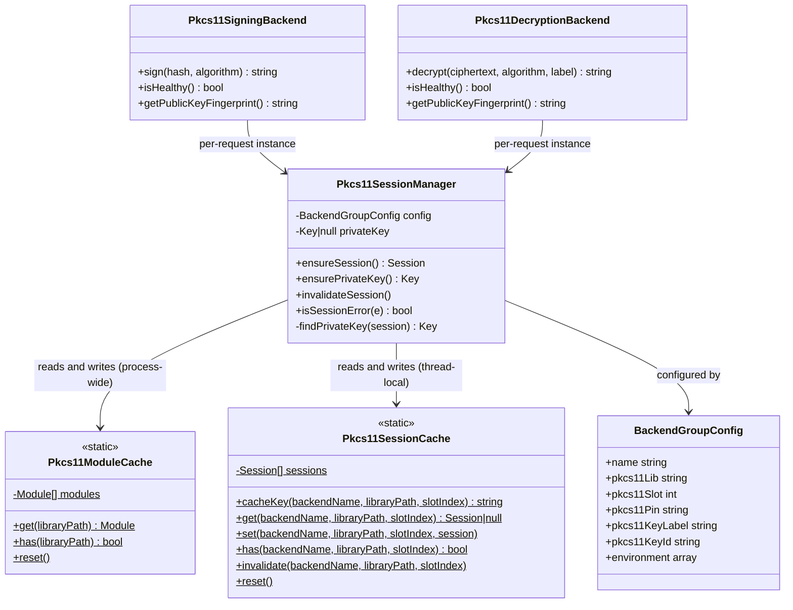

# OpenConext Private Key Agent Design Specification

**Project:** OpenConext Private-Key Agent  
**Date:** 2026-04-10  
**Version:** 1.0
**Author:** Martin Roest <martin.roest@dawn.tech>  

## Introduction

The Private Key Agent is a service that exposes a REST API for creating signatures and decrypting data using one or more private keys that it protects. It is designed to be used by other services that need to sign and decrypt data but do not want to handle the protection of private keys themselves. The agent runs in a separate process and user context, potentially on a different host, from the services that consume it.

The agent can be configured to use software keys, where the private key is stored in a file on disk, or hardware keys, where the private key is stored in a hardware security module (HSM) using PKCS#11. The REST API is identical regardless of the backend used.

The intended consumers are the SimpleSAMLphp xml-security backends:

- <https://github.com/simplesamlphp/xml-security/blob/master/src/Backend/SignatureBackend.php>
- <https://github.com/simplesamlphp/xml-security/blob/master/src/Backend/EncryptionBackend.php>

### SimpleSAML integration

SimpleSAMLphp uses the `simplesamlphp/xml-security` library for all cryptographic XML operations. The library defines two pluggable backend interfaces — `SignatureBackend` and `EncryptionBackend` — that decouple the XML-level processing from the underlying cryptographic operations. The default implementation is `OpenSSL`, which uses PHP's native OpenSSL extension and requires the private key to be in memory within the PHP process.

To use the Private Key Agent instead, a thin adapter class must be implemented for each interface. The adapters are registered with the `SignatureAlgorithmFactory` and `KeyTransportAlgorithmFactory` before any signing or decryption is attempted. Once registered, SimpleSAML's XML layer calls them transparently — no other changes to SimpleSAMLphp are required.

#### XML Signature (IdP signing a SAML Response)

When a SimpleSAMLphp IdP signs a SAML Response or Assertion, the following happens inside `xml-security`:

1. `SignableElementTrait::doSign()` applies the required XML canonicalization (C14N) transforms to the element being signed and computes the SHA digest of the result. This digest is embedded in a `ds:Reference` node.
2. The `ds:SignedInfo` structure is built and itself canonicalized. This canonicalized byte string is the **signing input**.
3. `AbstractSigner::sign()` is called with that byte string. It delegates to `SignatureBackend::sign($key, $plaintext)`.

The `PrivateKeyAgent` adapter implementing `SignatureBackend` must:

1. Compute `hash($digestAlgorithm, $plaintext)` locally — the agent API accepts a pre-computed hash, not raw plaintext.
2. Call `POST /sign/{key_name}` with the Base64-encoded hash and the algorithm identifier.
3. Return the binary signature bytes to xml-security, which embeds them in `ds:SignatureValue`.

The private key never leaves the agent. Only the hash value crosses the network boundary.

#### XML Encryption (SP decrypting an encrypted SAML Assertion)

When a SimpleSAMLphp SP decrypts an encrypted SAML Assertion, the XML contains an `xenc:CipherValue` holding a symmetric session key that was RSA-encrypted with the SP's public key. The `EncryptionBackend::decrypt($key, $ciphertext)` method receives the RSA-encrypted session key bytes.

The `PrivateKeyAgent` adapter implementing `EncryptionBackend` must:

1. Call `POST /decrypt/{key_name}` with the Base64-encoded ciphertext and the algorithm (`rsa-pkcs1-v1_5` or one of the OAEP variants).
2. Return the decrypted session key bytes to xml-security, which uses them to decrypt the assertion content with AES.

The symmetric session key and the assertion content are never sent to the agent.

#### Integration diagram




---

## Design Principles

The agent only performs private key operations. It does not process the actual message or data that needs to be signed or decrypted. When signing, the client sends a hash value and algorithm, and the agent constructs the DigestInfo ASN.1 structure internally and returns the signature. When decrypting, the agent only unwraps the encryption key. The rest of the signing and decryption processing is performed by the client.

This design keeps the agent simple, minimises the size of the REST API calls, and aligns with its primary goal: protecting private keys. XML documents, certificates, and other high-level data are never sent to the agent.

### Scope of access control

Each client can be allowed access to multiple private keys. More fine-grained access control, such as specifying which operations a client may perform on a key, is not implemented. This could be added later if needed. HSM backends may provide their own operation-level access control independently.

### Forward compatibility

Responses may include additional fields beyond those documented. Clients must ignore any unknown fields in the response to allow for future additions without breaking changes.

## Supported Operations

The following private key operations are supported, chosen because they are commonly used in SAML (xml-security):

- RSA PKCS#1 v1.5 signature (CKM_RSA_PKCS)
- RSA PKCS#1 v1.5 decryption (CKM_RSA_PKCS)
- RSA PKCS#1 OAEP decryption (CKM_RSA_PKCS_OAEP)

More key types (e.g. ECC) and operations can be added in the future.

### Design rationale for signing

A raw RSA operation was considered but rejected because it may conflict with existing HSM policies that forbid raw RSA operations, and it pushes all padding responsibility to the client. The chosen middle ground lets the client send the hash value and the hashing algorithm, while the agent constructs the DigestInfo structure and performs the PKCS#1 v1.5 signature internally.

### Design rationale for decryption

For RSA PKCS#1 v1.5 decryption, the agent returns the decrypted value (the symmetric key when used with `http://www.w3.org/2001/04/xmlenc#rsa-1_5`). The client uses this key to decrypt the actual data.

For RSA PKCS#1 OAEP decryption, additional parameters are needed: the MGF1 hash algorithm and an optional OAEP label. The label is not typically used in XML Encryption.

---

## Technology Stack

| Component | Choice |
|---|---|
| Language | PHP 8.5 |
| Framework | Symfony 7.4 |
| HTTP layer | Plain Symfony controllers |
| API documentation | NelmioApiDocBundle (OpenAPI) |
| PKCS#11 bridge | `gamringer/php-pkcs11` PHP extension |
| Logging | Monolog with JSON formatter to stdout |
| Testing | PHPUnit with mock interfaces |
| Deployment | Docker (FrankenPHP worker mode, single container with embedded Caddy) |

> **PHP 8.5 is a hard requirement.** PHP 8.5 adds an optional `digest_algo` parameter to `openssl_private_decrypt()` and `openssl_public_encrypt()`, which is the only way to select the OAEP hash algorithm (SHA-256, SHA-384, SHA-512, etc.) when using the OpenSSL backend. Prior to PHP 8.5, `OPENSSL_PKCS1_OAEP_PADDING` hard-codes SHA-1 for both the hash and MGF1 hash, making the `rsa-pkcs1-oaep-mgf1-sha256/384/512` algorithm variants impossible to implement in the OpenSSL backend. Downgrading to PHP 8.4 would require restricting the OpenSSL backend to `rsa-pkcs1-oaep-mgf1-sha1` only.
>
> Verify during implementation that the `digest_algo` parameter controls both the OAEP hash and the MGF1 hash, and clarify whether an OAEP label can be passed through this API.

---

## REST API

### Authentication

All endpoints except `/health` and `/health/backend/{backend_name}` require a Bearer token in the `Authorization` header (RFC 6750). Tokens are matched against `token` values in the configuration using `hash_equals()` to prevent timing attacks.

> **This is a static pre-shared bearer token scheme, not OAuth 2.0 client credentials.**
>
> The `token` value in the configuration is the bearer token itself — the exact string the client places in the `Authorization: Bearer <value>` header. There is no token endpoint and no client credentials exchange.
>
> The field `allowed_keys` is a list of logical **key names** (matching key `name` values) that the client is authorised to use. It is not a set of cryptographic keys or client certificates.

### `POST /sign/{key_name}`

Signs a hash value using the specified key. The `key_name` path parameter must match `[a-zA-Z0-9_-]{1,64}`.

Request:

```
Authorization: Bearer <token>
Content-Type: application/json
```

```json
{
  "algorithm": "rsa-pkcs1-v1_5-sha256",
  "hash": "<Base64-encoded hash value>"
}
```

Supported algorithms: `rsa-pkcs1-v1_5-sha1`, `rsa-pkcs1-v1_5-sha256`, `rsa-pkcs1-v1_5-sha384`, `rsa-pkcs1-v1_5-sha512`

Response `200`:

```json
{
  "signature": "<Base64-encoded signature>"
}
```

### `POST /decrypt/{key_name}`

Decrypts ciphertext using the specified key. The `key_name` path parameter must match `[a-zA-Z0-9_-]{1,64}`.

Request:

```
Authorization: Bearer <token>
Content-Type: application/json
```

```json
{
  "algorithm": "rsa-pkcs1-v1_5",
  "encrypted_data": "<Base64-encoded ciphertext>",
  "label": "<Base64-encoded OAEP label, optional>"
}
```

Supported algorithms: `rsa-pkcs1-v1_5`, `rsa-pkcs1-oaep-mgf1-sha1`, `rsa-pkcs1-oaep-mgf1-sha224`, `rsa-pkcs1-oaep-mgf1-sha256`, `rsa-pkcs1-oaep-mgf1-sha384`, `rsa-pkcs1-oaep-mgf1-sha512`

The `label` field is only relevant for OAEP algorithms and is not typically used in XML Encryption.

Response `200`:

```json
{
  "decrypted_data": "<Base64-encoded decrypted data>"
}
```

### `GET /health`

No authentication required. Returns `200` if all backends are healthy, `503` otherwise.

Response `200`:

```json
{ "status": "OK" }
```

Response `503`:

```json
{
  "status": 503,
  "error": "server_error",
  "message": "One or more backends are unhealthy",
  "unhealthy_backends": ["softhsm"]
}
```

### `GET /health/backend/{backend_name}`

No authentication required. The `backend_name` path parameter must match the `name` field of a configured `backend_groups` entry (e.g. `openssl-signing`, `softhsm`).

Returns `200` if all instances of the named backend are healthy, `503` if any instance is unhealthy, `404` if no backend with that name is registered.

Response `200`:

```json
{ "status": "OK", "backend_name": "softhsm" }
```

Response `503`:

```json
{
  "status": 503,
  "error": "server_error",
  "message": "Backend is unhealthy",
  "backend_name": "softhsm"
}
```

Response `404`:

```json
{
  "status": "not_found",
  "backend_name": "unknown-name"
}
```

Health check behaviour per backend type:

- **OpenSSL**: healthy if the key(s) loaded successfully at boot (checked statically, no runtime probe)
- **PKCS#11**: actively probed on each health request via `C_GetSessionInfo`

### Error Responses

All error responses follow RFC 6750 and use this JSON structure:

```json
{
  "status": 403,
  "error": "access_denied",
  "message": "Optional human-readable detail"
}
```

The HTTP status code in the response body must match the actual HTTP response status code.

On `401`, the response also includes the `WWW-Authenticate` header:

```
WWW-Authenticate: Bearer realm="<agent_name>", error="invalid_token", error_description="..."
```

| HTTP Status | Error Code | Cause |
|---|---|---|
| 400 | `invalid_request` | Missing or invalid request parameter, or key not registered for the requested operation |
| 401 | `invalid_token` | Missing or invalid bearer token |
| 403 | `access_denied` | Client not permitted to use the key |
| 500 | `server_error` | Backend failure (OpenSSL or PKCS#11 error) |

---

## Configuration

### Loading

The agent configuration is loaded from a YAML file at runtime. The path is set via the `PRIVATE_KEY_AGENT_CONFIG` environment variable. The file is loaded during Symfony kernel boot. If the file is missing, unreadable, or invalid, the application fails fast — the FrankenPHP worker will not start and will log the error.

### Environment variable references

The path to the configuration file is read from the `PRIVATE_KEY_AGENT_CONFIG` environment variable, resolved by Symfony's DI container via `services.yaml`.

Values inside the config file (e.g. `token`, `pkcs11_pin`) are plain strings — `ConfigLoader` uses `Symfony\Component\Yaml::parseFile()` directly and does **not** resolve `%env(...)%` references. Sensitive values must be supplied as plaintext strings or via a secrets management solution external to the agent (e.g. a mounted secrets file, Docker/Kubernetes secrets written to the config file on startup).

### Example config file

```yaml
agent_name: my-private-key-agent

backend_groups:
  - name: software-backend
    type: openssl
    key_path: /etc/private-key-agent/keys/signing.pem

  - name: hsm-signing-backend
    type: pkcs11
    pkcs11_lib: /usr/lib/softhsm/libsofthsm2.so
    pkcs11_slot: 0
    pkcs11_pin: "hsm-pin-value"
    pkcs11_key_label: signing-key
    environment:
      SOFTHSM2_CONF: /etc/softhsm2.conf

  - name: hsm-decryption-backend
    type: pkcs11
    pkcs11_lib: /usr/lib/softhsm/libsofthsm2.so
    pkcs11_slot: 1
    pkcs11_pin: "hsm-pin-value"
    pkcs11_key_id: "02"
    environment:
      SOFTHSM2_CONF: /etc/softhsm2.conf

keys:
  - name: my-signing-key
    signing_backends:
      - hsm-signing-backend
    decryption_backends:
      - software-backend

  - name: my-decryption-key
    signing_backends: []
    decryption_backends:
      - hsm-decryption-backend

clients:
  - name: simplesamlphp
    token: "bearer-token-value"
    allowed_keys:
      - my-signing-key
      - my-decryption-key
```

### Config Field Reference

#### Agent

- `agent_name`: The name of this agent. Used in `WWW-Authenticate` response headers as the `realm` value.

#### Backend Groups

Each entry in `backend_groups` represents a single cryptographic backend holding exactly one private key. Keys (defined in the `keys` section) reference one or more backend groups by name, forming a logical key identity that can be served by multiple backends for round-robin load distribution.

- `name`: Unique name for the backend group. Referenced from key `signing_backends` / `decryption_backends`.
- `type`: `openssl` or `pkcs11`.
- `environment`: *(optional)* A map of environment variable names to string values. For PKCS#11 backends these variables are set via `putenv()` before the PKCS#11 module is loaded, allowing vendor-specific configuration (e.g. `SOFTHSM2_CONF`, `ChrystokiConfigurationPath`) to be co-located with the backend definition. Ignored by OpenSSL backends.

OpenSSL-specific options:

- `key_path`: Path to a PEM private key file. Only RSA keys are supported; the backend validates at startup that the loaded key is RSA and throws a `BackendException` otherwise.

PKCS#11-specific options:

- `pkcs11_lib`: Path to the PKCS#11 shared library (`.so` / `.dylib`).
- `pkcs11_slot`: PKCS#11 slot number.
- `pkcs11_pin`: *(optional)* PIN to authenticate to the token.
- `pkcs11_key_label`: *(optional)* `CKA_LABEL` of the key object. At least one of `pkcs11_key_label` or `pkcs11_key_id` must be set.
- `pkcs11_key_id`: *(optional)* `CKA_ID` of the key object. If both are set, both are used to find the key. Exactly one matching key must be found.

#### Keys

Each entry in `keys` defines a logical key identity that clients can reference. A key maps operations to one or more backend groups, decoupling the logical key name from the physical backend. This allows using an HSM backend for signing and an OpenSSL backend for decryption, or distributing load across multiple HSMs.

- `name`: Logical key name. Used by clients in the request `key_name` field and in `allowed_keys`. Must be unique.
- `signing_backends`: List of backend group `name` values that handle signing for this key. Multiple entries enable round-robin distribution across backends.
- `decryption_backends`: List of backend group `name` values that handle decryption for this key. Multiple entries enable round-robin distribution across backends.

**Round-robin high availability:** when multiple backend groups are listed for an operation, the agent cycles through them on successive requests. All backend groups listed for the same operation should hold the same private key material.

#### Client

- `name`: Name of the client. Used in logs for identification.
- `token`: The bearer token the client sends in `Authorization: Bearer <value>`. This is the token itself, not an OAuth2 client secret used to obtain a token. Compared using `hash_equals()` to prevent timing attacks.
- `allowed_keys`: List of logical key names (matching key `name` values) that this client is permitted to use. Use `["*"]` to grant access to all configured keys.

---

## Project Structure

### Folder Layout

| Directory | Purpose |
|---|---|
| `bin/` | Symfony console entry point (`bin/console`) |
| `config/` | Symfony configuration: routing, service wiring, and package configs (monolog, nelmio, security) |
| `docker/` | Docker build artefacts: multi-stage `Dockerfile`, embedded `Caddyfile`, and PHP ini files |
| `public/` | Web root: `index.php` (direct entry point) and `worker.php` (FrankenPHP worker-loop entry point) |
| `src/Backend/` | Cryptographic backend implementations (OpenSSL and PKCS#11), backend factory, backend interfaces, and per-worker PKCS#11 caching utilities (`Pkcs11ModuleCache`, `Pkcs11SessionCache`, `Pkcs11SessionManager`) |
| `src/Command/` | Symfony console commands; currently `ValidateConfigCommand` for offline configuration validation |
| `src/Config/` | Configuration loading (`ConfigLoader`, `ConfigProvider`) and immutable value objects for agent, backend group, key, and client configuration |
| `src/Controller/` | REST API controllers: `SignController`, `DecryptController`, `HealthController` |
| `src/Crypto/` | Low-level cryptographic utilities; currently `DigestInfoBuilder` (DER-encodes the DigestInfo ASN.1 structure for PKCS#1 v1.5 signing) |
| `src/Dto/` | Request data transfer objects (`SignRequest`, `DecryptRequest`) with Symfony validation constraints |
| `src/EventSubscriber/` | `ExceptionSubscriber` maps domain exceptions to RFC 6750 HTTP error responses |
| `src/Exception/` | Domain exception hierarchy (`AuthenticationException`, `AccessDeniedException`, `BackendException`, `InvalidRequestException`, `InvalidConfigurationException`) |
| `src/Security/` | Authentication (`TokenAuthenticator`) and key-level access control (`AccessControlService`) |
| `src/Service/` | Key registry (`KeyRegistry`, `KeyRegistryBootstrapper`, `KeyRegistryInterface`) — maps logical key names to backend instances with round-robin distribution |
| `src/Validator/` | Custom Symfony validation constraint (`Base64`, `Base64Validator`) |
| `tests/Unit/` | Unit tests using mocks; no I/O or cryptographic operations required |
| `tests/Integration/` | Integration tests for the cryptographic backends against real key material (OpenSSL key pair; SoftHSM2 for PKCS#11) |
| `tools/` | Operator scripts (smoke test endpoint script) |
| `var/` | Symfony runtime cache and logs (excluded from VCS) |

### Key Class Overview

The diagram below shows the main classes and their relationships. Configuration value objects and static cache utilities are omitted for clarity; they are described individually in the [Key Components](#key-components) section below.



---

## Key Components

### `ConfigProvider`

Thin singleton wrapper around `ConfigLoader`. Receives the config file path via Symfony DI as `$configPath: '%env(string:PRIVATE_KEY_AGENT_CONFIG)%'` (resolved from the `PRIVATE_KEY_AGENT_CONFIG` environment variable at container boot). Calls `ConfigLoader::load()` on first access and caches the result.

### `ConfigLoader`

- Reads the YAML file at the path provided by `ConfigProvider` (which receives it from `PRIVATE_KEY_AGENT_CONFIG` via Symfony DI).
- Throws on any error — no partial loading.
- Invoked during Symfony kernel boot via service constructor.

Performs the following explicit validations (throws `InvalidConfigurationException` on any failure, preventing worker start):

**Structural / required fields:**

- `agent_name`: required, non-empty string.
- At least one backend group defined in `backend_groups`.
- `name`: required per backend group; **unique across all backend groups**.
- `type`: required; must be `openssl` or `pkcs11`.
- OpenSSL: `key_path` required.
- PKCS#11: `pkcs11_lib` required; `pkcs11_slot` required.
- PKCS#11 key: at least one of `pkcs11_key_label` or `pkcs11_key_id` must be set.
- At least one key defined in `keys`.
- `name`: required per key; must match `[a-zA-Z0-9_-]{1,64}`; **unique within keys**.
- At least one client defined in `clients`.
- `name`: required per client; **unique across all clients**.
- `token`: required; **must be non-empty** (an empty token would authenticate blank-token requests — security issue).
- `allowed_keys`: required; non-empty list.

**Semantic / cross-reference checks:**

- Every backend group referenced by a key's `signing_backends` or `decryption_backends` list must match a `name` defined in `backend_groups`. Orphaned backend references are rejected here rather than at request time.
- Every backend group defined in `backend_groups` must be referenced by at least one key (`validateNoOrphanBackends`). An unreferenced backend group is treated as a configuration error.

> `ValidateConfigCommand` reuses `ConfigLoader` for all of the above. Successful parsing means the config is structurally valid; it does not open key files or HSM sessions.

> **RSA-only enforcement:** Only RSA private keys are currently supported. OpenSSL backends validate this at construction time (checking for an RSA modulus in the key details); PKCS#11 backends restrict key lookup using the `CKA_KEY_TYPE = CKK_RSA` attribute filter. A non-RSA key causes immediate failure with a `BackendException`.

### `BackendFactory`

Responsible for instantiating all backend objects at boot. Delegates per-type construction to `BackendTypeFactoryInterface` implementations (`OpenSslBackendTypeFactory`, `Pkcs11BackendTypeFactory`). Returns a map of backend group name → `BackendInterface`. After building all backends, passes the map to `KeyRegistryBootstrapper` to populate `KeyRegistry`.

### `KeyRegistry` / `KeyRegistryBootstrapper`

- `KeyRegistryBootstrapper` is invoked at boot from `AgentConfig` (via `BackendFactory`) and populates the `KeyRegistry` with resolved `SigningBackendInterface` and `DecryptionBackendInterface` instances.
- `KeyRegistry` holds two separate maps: one for signing backends (key name → list of `SigningBackendInterface`) and one for decryption backends (key name → list of `DecryptionBackendInterface`).
- Provides `getSigningBackend(string $keyName): SigningBackendInterface` and `getDecryptionBackend(string $keyName): DecryptionBackendInterface` methods.
- If a key name is not registered for the requested operation, the registry throws `InvalidRequestException` (→ 400).
- Implements round-robin selection across backends for a given key name using per-instance counter arrays (`$signingCounters`, `$decryptionCounters`). The counter resets when a worker restarts (after reaching its max_requests recycle limit); distribution across workers is handled naturally by FrankenPHP routing each request to an available worker.
- **Lazy key equivalence check**: on the first request for a given `key_name` that maps to multiple backends, asserts all `getPublicKeyFingerprint()` values are identical. Throws `InvalidConfigurationException` if any mismatch is detected, logging the offending key name and the differing fingerprints. This check is performed lazily on the first request handled by each worker.

### `TokenAuthenticator`

- Implements the custom `AuthenticatorInterface` (not Symfony's `AbstractAuthenticator`).
- Is a plain Symfony service; controllers call `$this->authenticator->authenticate($token)` directly, bypassing the Symfony Security firewall.
- Extracts the Bearer token from the `Authorization` header.
- Iterates configured clients and compares tokens using `hash_equals()`.
- Returns the matched `ClientConfig` as the authenticated entity.
- Throws `AuthenticationException` (→ 401 with `WWW-Authenticate` header) when authentication fails.

### `AccessControlService`

- Called from `SignController` and `DecryptController` after authentication.
- Checks whether the authenticated client's `allowed_keys` list includes the requested `key_name`.
- Throws `AccessDeniedException` if not.

### `ExceptionSubscriber`

- Listens to `KernelEvents::EXCEPTION`.
- Maps domain exceptions to HTTP responses:
  - `InvalidRequestException` → 400
  - `AuthenticationException` → 401 + `WWW-Authenticate` header
  - `AccessDeniedException` → 403
  - `BackendException` → 500
  - Unhandled exceptions → 500

### Backend Interfaces

```php
interface BackendInterface
{
    /**
     * Returns the backend group name (as configured in YAML).
     */
    public function getName(): string;

    /**
     * Returns true if the backend is operational (key loaded, HSM session alive, etc.).
     */
    public function isHealthy(): bool;

    /**
     * Returns a hex SHA-256 fingerprint derived solely from the RSA public key modulus.
     * Used lazily inside the worker or by CLI commands to verify that all backends sharing a key_name hold the same key.
     * The fingerprint is not secret and may be logged.
     */
    public function getPublicKeyFingerprint(): string;
}

interface SigningBackendInterface extends BackendInterface
{
    public function sign(string $hash, string $algorithm): string;
}

interface DecryptionBackendInterface extends BackendInterface
{
    public function decrypt(string $ciphertext, string $algorithm, string|null $label = null): string;
}
```

**`getPublicKeyFingerprint()` implementation per backend type:**

- **OpenSSL backends**: `hash('sha256', openssl_pkey_get_details($key)['rsa']['n'])` — `$key['rsa']['n']` is the binary modulus returned by `openssl_pkey_get_details()`.
- **PKCS#11 backends**: retrieve `CKA_MODULUS` via `$keyObject->getAttributeValue([Pkcs11\CKA_MODULUS])` and SHA-256 hash the raw bytes.

### `DigestInfoBuilder`

Shared utility (no state, static methods) used by both signing backends. Prepends the correct DER-encoded DigestInfo prefix for the given algorithm to the provided hash bytes, producing the structure that `openssl_private_encrypt()` / `C_Sign(CKM_RSA_PKCS)` expect.

The DER prefixes are well-known constants from RFC 3447 §9.2 / PKCS#1:

| Algorithm | Prefix (hex) | Hash length |
|---|---|---|
| SHA-1 | `3021300906052b0e03021a05000414` | 20 |
| SHA-256 | `3031300d060960864801650304020105000420` | 32 |
| SHA-384 | `3041300d060960864801650304020205000430` | 48 |
| SHA-512 | `3051300d060960864801650304020305000440` | 64 |

`DigestInfoBuilder` is unit-tested independently using hardcoded input/output pairs, in addition to being implicitly validated by the OpenSSL and PKCS#11 integration tests which verify signatures against the public key.

### `OpenSslSigningBackend`

- Loads the PEM private key (with optional passphrase) at construction time.
- Constructs the DigestInfo ASN.1 structure internally by delegating to `DigestInfoBuilder`.
- Signs using `openssl_private_encrypt()` with `OPENSSL_PKCS1_PADDING` on the DigestInfo-wrapped hash.
- `isHealthy()` returns `true` if the key loaded successfully at boot.

### `OpenSslDecryptionBackend`

- Loads the PEM private key at construction time.
- Maps algorithm string to the appropriate `openssl_private_decrypt()` padding constant and `digest_algo` value (PHP 8.5+).
- For OAEP algorithms, passes the hash algorithm name via the `digest_algo` parameter added in PHP 8.5. Prior to PHP 8.5, only `rsa-pkcs1-oaep-mgf1-sha1` would be supportable with the OpenSSL backend.
- `isHealthy()` returns `true` if the key loaded successfully at boot.

### `Pkcs11SigningBackend`

- Lazily opens a PKCS#11 session on first use within the FrankenPHP worker using the configured library, slot, and PIN. The session is then reused for all subsequent requests handled by that worker.
- Implements inline session recovery: catches session errors (`CKR_SESSION_CLOSED`, `CKR_DEVICE_REMOVED`, etc.), forces a re-initialization sequence, and retries the signing operation before giving up.
- Maps algorithm string to PKCS#11 mechanism and delegates DigestInfo construction to `DigestInfoBuilder` before calling `C_Sign` with `CKM_RSA_PKCS`.
- `isHealthy()` calls `C_GetSessionInfo` to verify the session is still valid (opening it first if needed).

### `Pkcs11DecryptionBackend`

- Lazily opens a PKCS#11 session on first use within the FrankenPHP worker. The session is then reused for all subsequent requests handled by that worker.
- Implements inline session recovery: catches session errors, forces a re-initialization sequence, and retries the decryption operation before giving up.
- Maps algorithm string to PKCS#11 mechanism (e.g. `CKM_RSA_PKCS`, `CKM_RSA_PKCS_OAEP`).
- For OAEP algorithms, constructs `Pkcs11\RsaOaepParams` passing the hash algorithm, MGF1 algorithm, and optional label (source data) and bounds it to `Pkcs11\Mechanism`.
- `isHealthy()` calls `C_GetSessionInfo` (opening the session first if needed).

### PKCS#11 Session Persistence

Three classes collaborate to manage PKCS#11 module handles and session handles across FrankenPHP worker threads and individual HTTP requests. Their lifetime scopes are deliberately different:

| Class | Scope | Persists across requests? |
|---|---|---|
| `Pkcs11ModuleCache` | Process-wide static (thread-local in ZTS) | Yes — held for the entire worker thread lifetime |
| `Pkcs11SessionCache` | Thread-local static (thread-local in ZTS) | Yes — held for the entire worker thread lifetime |
| `Pkcs11SessionManager` | Per-request (DI-injected, new instance each request) | No — wraps the persistent caches but is itself transient |



### `Pkcs11ModuleCache`

Per-worker cache of `\Pkcs11\Module` instances, keyed by library path. In FrankenPHP worker mode, a static property on a class persists for the lifetime of the worker thread (not just the request). `Pkcs11ModuleCache` uses a static array to ensure each `.so` library is loaded and `C_Initialize`-d exactly once per worker thread. Subsequent PKCS#11 backends that reference the same library path share the already-initialised `Module` object.

Without this cache, each new `Pkcs11\Module($lib)` construction would call `C_Initialize` again. The `feature/php-zts` branch tolerates this (it returns `CKR_CRYPTOKI_ALREADY_INITIALIZED` and continues), but it would still create unnecessary duplicate module objects.

### `Pkcs11SessionCache`

Per-worker cache of `\Pkcs11\Session` instances, keyed by `backendName:libraryPath:slotIndex`. Static properties in PHP ZTS are scoped to each thread (each FrankenPHP worker runs as a separate thread), so the session opened by one worker is never visible to another worker — there is no cross-thread sharing or locking at this level.

Sessions are opened lazily on first use and then reused for all subsequent requests handled by the same worker. This avoids `C_OpenSession` and `C_Login` round-trips on every request. The cache is invalidated and the session re-established whenever a PKCS#11 session error (e.g. `CKR_SESSION_CLOSED`, `CKR_DEVICE_REMOVED`) is detected.

### `Pkcs11SessionManager`

Per-request service (new DI instance per HTTP request). Wraps `Pkcs11SessionCache` and `Pkcs11ModuleCache` to provide the following lifecycle management:

1. **`ensureSession()`**: Checks `Pkcs11SessionCache`; returns the cached session if present. Otherwise sets vendor environment variables via `putenv()`, fetches the `Module` from `Pkcs11ModuleCache`, calls `C_OpenSession` and (if `pkcs11_pin` is set) `C_Login`. Tolerates `CKR_USER_ALREADY_LOGGED_IN` (PKCS#11 treats the whole token as logged in once any session authenticates). Stores the new session in `Pkcs11SessionCache`.

2. **`ensurePrivateKey()`**: Calls `ensureSession()`, then finds the private key by `CKA_LABEL` / `CKA_ID` template match if not already found. The `Key` object is held as a per-request instance variable (not cached across requests — it is re-fetched cheaply from the cached session).

3. **`invalidateSession()`**: Removes the entry from `Pkcs11SessionCache` and clears the private key reference. Called by the signing/decryption backends when a session error is detected so the next operation triggers a full reconnect.

4. **`isSessionError(Exception $e)`**: Tests the PKCS#11 error code against a set of recoverable session errors: `CKR_SESSION_CLOSED` (0xB0), `CKR_SESSION_HANDLE_INVALID` (0xB3), `CKR_DEVICE_ERROR` (0x30), `CKR_DEVICE_REMOVED` (0x32), `CKR_TOKEN_NOT_PRESENT` (0xE0), `CKR_TOKEN_NOT_RECOGNIZED` (0xE1).

### `ValidateConfigCommand`

`bin/console app:validate-config <config-path>`

- Accepts a required `config-path` CLI argument.
- Loads and validates the config file by calling `ConfigLoader::load($path)`.
- Checks all required fields and semantic cross-references (see `ConfigLoader` section).
- Does not check whether OpenSSL key files or PKCS#11 library paths exist on disk, and does not open key files or HSM sessions.
- Exits with code 0 on success, 1 on failure with human-readable error output.

---

## Request DTO Validation

`#[Assert\Base64]` is a custom validation constraint (defined in `src/Validator/Base64.php` and `Base64Validator.php`). It validates that the value is a valid Base64-encoded string.

### `SignRequest`

```php
final class SignRequest
{
    public const array ALGORITHMS = [
        'rsa-pkcs1-v1_5-sha1',
        'rsa-pkcs1-v1_5-sha256',
        'rsa-pkcs1-v1_5-sha384',
        'rsa-pkcs1-v1_5-sha512',
    ];

    private const array HASH_LENGTHS = [
        'rsa-pkcs1-v1_5-sha1'   => 20,
        'rsa-pkcs1-v1_5-sha256' => 32,
        'rsa-pkcs1-v1_5-sha384' => 48,
        'rsa-pkcs1-v1_5-sha512' => 64,
    ];

    #[Assert\NotBlank]
    #[Assert\Choice(choices: self::ALGORITHMS, message: 'Invalid signing algorithm.')]
    public string $algorithm = '';

    #[Assert\NotBlank]
    #[Assert\Base64]
    public string $hash = '';

    #[Assert\Callback]
    public function validateHashLength(ExecutionContextInterface $context): void
    {
        if (!in_array($this->algorithm, self::ALGORITHMS, true)) {
            return; // algorithm already fails #[Assert\Choice]
        }
        if ($this->hash === '') {
            return; // NotBlank will handle this
        }
        $decoded = base64_decode($this->hash, strict: true);
        if ($decoded === false) {
            return; // Base64 validator will handle this
        }
        $expectedLength = self::HASH_LENGTHS[$this->algorithm];
        $actualLength   = strlen($decoded);
        if ($actualLength === $expectedLength) {
            return;
        }
        $context->buildViolation(sprintf(
            'Hash length %d bytes does not match expected %d bytes for %s.',
            $actualLength,
            $expectedLength,
            $this->algorithm,
        ))
            ->atPath('hash')
            ->addViolation();
    }
}
```

### `DecryptRequest`

```php
final class DecryptRequest
{
    public const array ALGORITHMS = [
        'rsa-pkcs1-v1_5',
        'rsa-pkcs1-oaep-mgf1-sha1',
        'rsa-pkcs1-oaep-mgf1-sha224',
        'rsa-pkcs1-oaep-mgf1-sha256',
        'rsa-pkcs1-oaep-mgf1-sha384',
        'rsa-pkcs1-oaep-mgf1-sha512',
    ];

    private const array OAEP_ALGORITHMS = [
        'rsa-pkcs1-oaep-mgf1-sha1',
        'rsa-pkcs1-oaep-mgf1-sha224',
        'rsa-pkcs1-oaep-mgf1-sha256',
        'rsa-pkcs1-oaep-mgf1-sha384',
        'rsa-pkcs1-oaep-mgf1-sha512',
    ];

    #[Assert\NotBlank]
    #[Assert\Choice(choices: self::ALGORITHMS, message: 'Invalid decryption algorithm.')]
    public string $algorithm = '';

    #[Assert\NotBlank]
    #[Assert\Base64]
    #[SerializedName('encrypted_data')]
    public string $encryptedData = '';

    #[Assert\Base64]
    public string|null $label = null;

    #[Assert\Callback]
    public function validateRequest(ExecutionContextInterface $context): void
    {
        // encrypted_data must decode to a plausible RSA ciphertext length (128–1024 bytes
        // covers RSA-1024 through RSA-8192; catches obviously malformed inputs early)
        if ($this->encryptedData !== '') {
            $decoded = base64_decode($this->encryptedData, strict: true);
            if ($decoded !== false) {
                $len = strlen($decoded);
                if ($len < 128 || $len > 1024) {
                    $context->buildViolation(sprintf(
                        'Encrypted data must be 128-1024 bytes, got %d bytes.',
                        $len,
                    ))
                        ->atPath('encryptedData')
                        ->addViolation();
                }
            }
        }

        // label is only meaningful for OAEP algorithms
        if ($this->label === null || in_array($this->algorithm, self::OAEP_ALGORITHMS, true)) {
            return;
        }
        $context->buildViolation('Label is only allowed for OAEP algorithms.')
            ->atPath('label')
            ->addViolation();
    }
}
```

> **Exact modulus-length check (backend responsibility):** The ciphertext must be exactly `modulus_bytes` long (e.g., 256 bytes for RSA-2048). This cannot be checked at DTO validation time because the key size is only known after the backend is resolved. Each decryption backend (`OpenSslDecryptionBackend`, `Pkcs11DecryptionBackend`) validates `strlen(ciphertext) === $this->getModulusBytes()` before attempting decryption and throws `InvalidRequestException` (→ 400) on mismatch, not `BackendException` (→ 500).

---

## Logging

Monolog with a JSON formatter writes to stdout (12-factor app). The log level is controlled by the `LOG_LEVEL` environment variable (default: `info`). FrankenPHP's own access log and error output also go to stdout/stderr.

| Level | Events |
|---|---|
| INFO | Each sign/decrypt request: client name, key name, algorithm |
| WARNING | Access denied, invalid token attempts |
| ERROR | Backend failures, config load failures |
| **Never logged** | Bearer tokens, key material, hash values, plaintext data, decrypted values |

---

## Composer Dependencies

```json
{
  "require": {
    "php": "^8.5",
    "nelmio/api-doc-bundle": "^4.0",
    "symfony/console": "^7.4",
    "symfony/framework-bundle": "^7.4",
    "symfony/monolog-bundle": "^3.10",
    "symfony/property-access": "^7.4",
    "symfony/runtime": "^7.4",
    "symfony/security-bundle": "^7.4",
    "symfony/serializer": "^7.4",
    "symfony/validator": "^7.4",
    "symfony/yaml": "^7.4"
  },
  "require-dev": {
    "doctrine/coding-standard": "^14.0",
    "overtrue/phplint": "^9.7",
    "phpstan/extension-installer": "^1.4",
    "phpstan/phpstan": "^2.1",
    "phpstan/phpstan-phpunit": "^2.0",
    "phpstan/phpstan-symfony": "^2.0",
    "phpunit/phpunit": "^11.0",
    "squizlabs/php_codesniffer": "^4.0",
    "symfony/dotenv": "^8.0",
    "symfony/test-pack": "^1.0"
  }
}
```

The `gamringer/php-pkcs11` extension is installed as a system package in the Docker image, not via Composer.

---

## Docker

### Multi-stage `docker/Dockerfile`

Three stages:

- **`base`**: `dunglas/frankenphp:1-php8.5-bookworm` (Debian 12, PHP 8.5 ZTS with embedded Caddy). The `php-pkcs11` extension is built from source using the [`feature/php-zts` branch of `mroest/php-pkcs11`](https://github.com/mroest/php-pkcs11/tree/feature/php-zts), which ships native ZTS support for FrankenPHP worker mode. Composer binary is copied in.
- **`prod`**: Extends `base` with production Composer dependencies, optimised autoloader, PHP OPcache settings from `docker/app.ini`, and a pre-warmed Symfony cache (`APP_DEBUG=0`). Runs as root (required to bind port 443); `opcache.preload_user = www-data` in `app.ini` drops privileges for the preload phase.
- **`dev`**: Extends `prod` with `softhsm2` and `opensc` installed from the Debian package repository. An RSA-2048 test key pair is pre-generated in the image so that the PKCS#11 integration tests can run without any host-side HSM.

> **Why Debian instead of Alpine**
>
> The Alpine image required a musl libc `LD_PRELOAD` stub workaround: musl's `RTLD_NOW` flag resolves all pending lazy relocations across every loaded DSO when any `dlopen(RTLD_NOW)` is called, including a dangling reference to `php_cli_get_shell_callbacks` — a symbol defined only in the CLI SAPI. This caused PKCS#11 library loading to fail in PHP-FPM. Debian's glibc uses true lazy binding and never triggers this, eliminating the stub entirely. The switch to FrankenPHP (which requires Debian for ZTS support) also removes the Alpine dependency.

### PHP configuration (`docker/app.ini`)

OPcache and PHP runtime settings are stored in `docker/app.ini` instead of being generated inline in the Dockerfile. The file is `COPY`'d into the production image and volume-mounted from the host in `compose.yaml`, making it easy to tune settings without rebuilding.

### Embedded Caddy (`docker/Caddyfile`)

FrankenPHP includes Caddy as an embedded server — no separate sidecar container is needed.

The Caddyfile uses FrankenPHP's native `php_server` directive instead of FastCGI reverse proxy:

- Global `frankenphp {}` block declares 16 persistent PHP workers running `public/worker.php` in a loop.
- `localhost` site block: `tls internal` for TLS, `php_server` to dispatch requests to workers, security headers (`-Server`, `X-Content-Type-Options`, `X-Frame-Options`), JSON access log to stdout.
- No rate limiting (operator responsibility).

### `compose.yaml`

The compose file is intended for development. Single service:

- `app`: FrankenPHP container (`dev` stage), mounts the application source tree, config file, `docker/app.dev.ini`, and `docker/Caddyfile` as read-only volumes. Exposes port 443. Does not set `PRIVATE_KEY_AGENT_CONFIG` explicitly in the compose file — the value must be supplied via a `.env` file or shell environment. Worker recycling is controlled by the `FRANKENPHP_LOOP_MAX` environment variable (default in `worker.php`: 2000 requests per worker); it is not set in the compose file, so workers recycle after 2000 requests by default.

---

## FrankenPHP Concurrency Model

### Overview

FrankenPHP runs PHP in **worker mode**: a fixed pool of long-lived OS threads, each executing one PHP worker script (`public/worker.php`) in a continuous loop. Every thread handles one HTTP request at a time — there is no async within a single worker. Concurrency comes entirely from having multiple worker threads.

The FrankenPHP base image (`dunglas/frankenphp:1-php8.5-bookworm`) is a **ZTS (Zend Thread Safety)** build of PHP. In a ZTS PHP build each thread has its own copy of the PHP executor globals, but static class properties are thread-local by default (each thread sees its own copy of a static property). This is the property that the PKCS#11 session and module caches rely on.

```
Process
├── Worker Thread 1  ──── static Pkcs11SessionCache::$sessions [ "backend-a:lib:0" => Session ]
│                    ──── static Pkcs11ModuleCache::$modules   [ "/usr/lib/softhsm2.so" => Module ]
├── Worker Thread 2  ──── static Pkcs11SessionCache::$sessions [ "backend-a:lib:0" => Session ]
│                    ──── static Pkcs11ModuleCache::$modules   [ "/usr/lib/softhsm2.so" => Module ]
└── Worker Thread N  ──── ...
```

### Static Properties as Thread-Local Storage

In PHP ZTS, static class properties are stored in the per-thread executor globals. Their values **do not** persist across PHP-FPM request boundaries in a traditional FPM setup, but in FrankenPHP worker mode the worker thread *never restarts between requests* — it loops and handles the next request in the same PHP context. Static properties therefore persist across all requests handled by the same worker thread for the thread's entire lifetime (bounded by `FRANKENPHP_LOOP_MAX`).

This means:

- `Pkcs11SessionCache::$sessions` holds PKCS#11 session handles that survive from request to request within a worker.
- `Pkcs11ModuleCache::$modules` holds the loaded `\Pkcs11\Module` objects (one per library path) that also persist across requests.
- `KeyRegistry`'s round-robin counters (`$signingCounters`, `$decryptionCounters`) also persist, so each worker independently cycles through backends.

Each worker thread has its own independent copies of all these caches — there is no cross-thread sharing, no mutex needed at the PHP level.

### Worker Entry-Point: `public/worker.php`

`public/worker.php` is the custom FrankenPHP worker entry-point (declared in the `Caddyfile` worker directive). It differs from the default `public/index.php` entry-point in two ways:

1. **Pre-initialisation outside the request loop.** Before entering the `frankenphp_handle_request()` loop, it boots the Symfony kernel once and then calls `$backend->isHealthy()` for every registered backend. For PKCS#11 backends, `isHealthy()` calls `ensureSession()` (via `Pkcs11SessionManager`), which opens the HSM session and performs `C_Login`. The session handle is stored in `Pkcs11SessionCache`. From that point on, every request handled by this worker thread reuses the open session — no `C_OpenSession` or `C_Login` on the hot path.

2. **Request loop with bounded recycling.** The loop runs until FrankenPHP signals shutdown (`$ret === false`) or the worker has processed `FRANKENPHP_LOOP_MAX` requests (default: 2000). After each request, `$kernel->terminate()` is called outside the callback and `gc_collect_cycles()` forces a GC cycle. On exit the worker thread is respawned by FrankenPHP automatically.

```php
// Pseudocode of worker.php structure
$kernel->boot();
foreach ($registry->getAllBackends() as $backend) {
    $backend->isHealthy(); // Opens PKCS#11 session eagerly — cached in Pkcs11SessionCache
}

do {
    $ret = frankenphp_handle_request(function () use ($kernel) {
        $response = $kernel->handle(Request::createFromGlobals());
        $response->send();
    });
    $kernel->terminate(...);
    gc_collect_cycles();
} while ($ret && $loops++ < $maxRequests);
```

### PKCS#11 Session Lifecycle per Worker

```
Worker startup
    └─ worker.php boots kernel
    └─ foreach backend → isHealthy()
           └─ Pkcs11SessionManager::ensureSession()
                  └─ Pkcs11ModuleCache::get($lib)     ← dlopen, C_Initialize (once per lib)
                  └─ $module->openSession($slotId)     ← C_OpenSession
                  └─ $session->login(CKU_USER, $pin)   ← C_Login
                  └─ Pkcs11SessionCache::set(...)      ← cached for lifetime of worker

Request N (hot path)
    └─ Pkcs11SessionManager::ensureSession()
           └─ Pkcs11SessionCache::get(...)             ← cache hit, no C_OpenSession/C_Login

Request N (session error path)
    └─ C_Sign / C_Decrypt raises CKR_SESSION_CLOSED
    └─ Backend catches exception, calls invalidateSession()
           └─ Pkcs11SessionCache::invalidate(...)
    └─ Backend calls ensurePrivateKey() again
           └─ ensureSession() → cache miss → full reconnect
    └─ Retry the cryptographic operation once

Worker recycle (after FRANKENPHP_LOOP_MAX requests)
    └─ Loop exits; FrankenPHP spawns replacement worker thread
    └─ Static properties cleared; new thread starts fresh
```

### `putenv()` and Vendor Environment Variables

The `environment:` block in each PKCS#11 backend group config is applied via `putenv()` before the module is loaded. `putenv()` modifies the **process-wide** C environment, which is shared across all worker threads. In practice this is safe because all workers set the same values (the config is immutable after boot), so concurrent calls are idempotent. The `putenv()` calls happen before `Pkcs11ModuleCache::get()` stores the `Module` object; once the module is cached subsequent session opens do not re-call `putenv()`.

### Worker Count and HSM Session Budget

Each worker thread holds one PKCS#11 session per configured PKCS#11 backend group. The total number of sessions the agent opens against an HSM is:

```
sessions = replicas × worker_count × pkcs11_backend_groups_per_worker
```

The worker count is set in the `Caddyfile` (currently 16). This must not exceed the HSM's session limit. See the Performance Requirements section for sizing guidance.

---

## PHP PKCS#11 Extension — ZTS Support

The `php-pkcs11` extension is built from the [`feature/php-zts` branch of `mroest/php-pkcs11`](https://github.com/mroest/php-pkcs11/tree/feature/php-zts). This branch adds native ZTS (Zend Thread Safety) support for FrankenPHP worker mode, addressing the three thread-safety issues present in the original `gamringer/php-pkcs11` upstream:

1. **Serialised `C_Initialize`** — a `pthread_mutex_t` guards concurrent initialisation across worker threads.
2. **`CKR_CRYPTOKI_ALREADY_INITIALIZED` tolerance** — subsequent worker threads receive this code from an already-initialised library and continue rather than aborting.
3. **Reference-counted `C_Finalize` / `dlclose`** — the library is only torn down when the last `Module` object across all worker threads is freed.

The Dockerfile clones with `--branch feature/php-zts --depth=1` and builds directly.

---

## HSM Communication in a Docker-Based Setup

### How communication works

The PKCS#11 architecture is **in-process**: the vendor-supplied shared library (`.so`) is loaded directly into the FrankenPHP worker by the `gamringer/php-pkcs11` extension using `dlopen`. There is no separate daemon or sidecar for HSM communication — function calls like `C_Sign` and `C_Decrypt` are plain C function calls into the library, which then handles the actual transport to the HSM.

This means the shared library and any vendor-specific client software it depends on must be present inside the FrankenPHP container. The library is either baked into the Docker image (for well-known open-source modules like SoftHSM2) or mounted from the host (for proprietary vendor libraries). The private key material never crosses the container boundary — it stays inside the HSM.

The transport between the library and the HSM depends on the physical form factor:

| HSM type | Transport | Docker requirement |
|---|---|---|
| Network HSM (Thales Luna Network, nShield Connect) | TCP/IP to the appliance on the network | Container needs network access (standard). Mount vendor client config and optionally a client certificate. |
| Cloud HSM (AWS CloudHSM, Azure Managed HSM) | TCP/IP to cloud endpoint | Container needs outbound internet/VPC access. Mount vendor client config and credentials. |
| USB HSM (YubiHSM 2, Nitrokey HSM 2) | USB to the host | Pass the USB device through to the container via `devices:` in `compose.yaml`. |
| PCIe HSM (Luna PCIe, nShield Solo) | PCIe via a host-side vendor daemon | Mount the Unix socket exposed by the vendor daemon using a `volumes:` bind mount. |

### Architecture diagram

```
┌────────────────────────────────────────┐
│  FrankenPHP container (app)            │
│                                        │
│  ┌──────────┐   ┌──────────────────┐   │
│  │  Caddy   │   │  PHP Workers×16  │   │
│  │ (built-  │──▶│  (worker mode)   │   │
│  │  in TLS) │   │                  │   │
│  └──────────┘   │  PrivateKeyAgent │   │
│                 │  Pkcs11Backend   │   │
│                 │       │          │   │
│                 │  PKCS#11 .so lib │   │
│                 │  (in-process)    │   │
│                 └──────┼───────────┘   │
└────────────────────────┼───────────────┘
                              │
        ┌─────────────────────▼──────────────────────┐
        │                    HSM                     │
        │  (physical appliance, USB token, or cloud) │
        │                                            │
        │  Private key stored and used here only.    │
        │  Cryptographic result returned; key never  │
        │  leaves the HSM boundary.                  │
        └────────────────────────────────────────────┘
```

### Example: network HSM (Thales Luna)

The vendor client package is installed in the Docker image. It includes the `.so` library and a configuration file (`Chrystoki.conf`) that specifies the appliance hostname and port. The container needs network access to the appliance and a mounted client certificate if mutual TLS is required.

```yaml
# compose.yaml (excerpt)
services:
  app:
    volumes:
      - /etc/Chrystoki.conf:/etc/Chrystoki.conf:ro
      - /etc/luna/cert:/etc/luna/cert:ro
    environment:
      PRIVATE_KEY_AGENT_CONFIG: /etc/private-key-agent/config.yaml
```

### Example: USB HSM (YubiHSM 2)

The YubiHSM 2 is connected to the host via USB. The PKCS#11 library communicates with it through the `yubihsm-connector` daemon running on the host, exposed as a Unix socket or local HTTP endpoint. Pass the socket or use the connector's default HTTP port.

```yaml
# compose.yaml (excerpt)
services:
  app:
    volumes:
      - /run/yubihsm-connector:/run/yubihsm-connector:ro
    environment:
      YUBIHSM_PKCS11_CONF: /etc/yubihsm_pkcs11.conf
      PRIVATE_KEY_AGENT_CONFIG: /etc/private-key-agent/config.yaml
```

### Example: SoftHSM2 (development / CI)

SoftHSM2 stores tokens as files on disk. The library and token directory are both inside the container (or mounted from the host). No USB passthrough or network access is required.

```yaml
# compose.yaml (excerpt)
services:
  app:
    volumes:
      - /var/lib/softhsm/tokens:/var/lib/softhsm/tokens:ro
    environment:
      SOFTHSM2_CONF: /etc/softhsm2.conf
      PRIVATE_KEY_AGENT_CONFIG: /etc/private-key-agent/config.yaml
```

---

## Testing Strategy

The test suite is split into two directories with different infrastructure requirements.

### Unit tests (`tests/Unit/`)

All services, controllers, authenticator, exception subscriber, DTOs, config loader, command, and validators are tested with PHPUnit using mocks or pure PHP. No cryptographic operations are performed and no HSM or OpenSSL key material is required. These tests run on any standard PHP environment and are always part of the main CI pipeline.

Unit test coverage includes: `BackendFactory`, `OpenSslBackendTypeFactory`, `Pkcs11BackendTypeFactory`, `ValidateConfigCommand`, `ConfigLoader`, `DecryptController`, `HealthController`, `SignController`, `DigestInfoBuilder`, `DecryptRequest`, `SignRequest`, `ExceptionSubscriber`, `AccessControlService`, `TokenAuthenticator`, `KeyRegistryBootstrapper`, `KeyRegistry`, `Base64Validator`.

### Integration tests (`tests/Integration/`)

`OpenSslSigningBackend`, `OpenSslDecryptionBackend`, `Pkcs11SigningBackend`, and `Pkcs11DecryptionBackend` are tested against real RSA private key operations.

**OpenSSL integration tests** have no external dependencies. A test key pair is generated at the start of the test run and these tests run in the main CI pipeline alongside the unit tests.

**PKCS#11 integration tests** require a real PKCS#11 token. **These tests cannot be mocked or faked** — only a real (or software-emulated) PKCS#11 token can exercise the native library calls. For CI, **SoftHSM2** is used as a software HSM emulator. A Docker-based SoftHSM2 environment is provided and runs as a dedicated CI step, separate from the main pipeline.

The PKCS#11 integration tests cover:

- Session initialisation and PIN authentication
- Key lookup by `CKA_LABEL` and `CKA_ID`
- RSA PKCS#1 v1.5 signing (`CKM_RSA_PKCS`) for all supported hash algorithms, with verification of the resulting signature against the public key
- RSA PKCS#1 v1.5 decryption (`CKM_RSA_PKCS`)
- RSA OAEP decryption (`CKM_RSA_PKCS_OAEP`) for all supported MGF1 hash algorithms
- The `isHealthy()` probe via `C_GetSessionInfo`

> **Note on physical HSM validation**: The SoftHSM2-based CI tests validate the agent's PKCS#11 integration layer, but they do not substitute for testing against a physical HSM in staging before production deployment. Physical HSMs may enforce additional access policies, PIN lockout behaviour, and mechanism restrictions that SoftHSM2 does not replicate. A smoke test against the target HSM model should be performed as part of any production rollout.

---

## Performance Requirements

> **Status**: Target performance requirements have not yet been defined by stakeholders. This section describes the dimensions that must be specified, provides calculated throughput estimates based on the current architecture, and the decisions that will need to be made once concrete targets are available.

### Dimensions to define

| Dimension | Description | Why it matters |
|---|---|---|
| **Signing throughput** | Number of sign operations per second (sustained) | Determines FrankenPHP worker count and whether a single HSM is sufficient |
| **Decryption throughput** | Number of decrypt operations per second (sustained) | As above; decrypt is typically more expensive than signing on HSMs |
| **Peak load** | Maximum burst operations per second | Determines whether the FPM worker count and HSM session budget can absorb spikes |
| **Latency (p95 / p99)** | Acceptable response time for a single sign or decrypt call | Affects HSM selection; network appliances add round-trip overhead versus local PCIe/USB |
| **Availability** | Required uptime (e.g. 99.9%, 99.99%) | Determines whether HSM redundancy (multiple units / slots) is required |
| **Key count** | Number of distinct private keys the agent must serve | Affects HSM slot planning and session management |

### Architectural impact

**FrankenPHP worker concurrency** (`worker` directive in `Caddyfile`)

Each worker thread holds one PKCS#11 session per configured PKCS#11 backend. The number of concurrent HSM operations the agent can perform equals `worker_count × number_of_pkcs11_backends`. Throughput and latency targets directly determine the required worker count. In a containerised deployment, horizontal scaling (multiple container replicas) multiplies this capacity at the cost of requiring more HSM sessions.

**HSM session limits**

Physical HSMs have a maximum number of concurrent sessions. For example, Thales Luna Network HSMs support hundreds to thousands of sessions depending on model and licence. YubiHSM 2 supports far fewer (around 16). If the worker count exceeds the HSM's session limit, sessions initialisation fails at boot. The session budget must be calculated as:

```
sessions_required = replicas × worker_count × pkcs11_backends_per_worker
```

**Round-trip latency**

For network and cloud HSMs, each `C_Sign` or `C_Decrypt` call includes a network round-trip to the HSM appliance or cloud endpoint. Under load this adds directly to p95/p99 latency. If latency targets are tight (e.g. < 20 ms), a local PCIe HSM or a low-latency network segment (same rack or availability zone) may be required. USB HSMs introduce USB bus latency and should only be considered for low-throughput use cases.

**HSM cryptographic throughput**

HSMs publish rated RSA operation throughputs (operations per second per key size). At 2048-bit RSA, enterprise appliances like Thales Luna Network reach thousands of operations per second. YubiHSM 2 is in the range of tens of operations per second for RSA. If throughput requirements exceed a single HSM's capacity, multiple HSM units can be used by adding multiple backend group entries pointing to different HSM units — the agent distributes load round-robin across backends automatically.

**Redundancy and availability**

For availability targets above 99.9%, plan for at least two HSM units (or two cloud HSM instances). The agent's round-robin distribution across multiple backends with the same key name provides load distribution. To handle temporary disruptions (e.g., network blips to an HSM appliance), the agent implements **inline session recovery**. If a PKCS#11 operation fails with a session-related error (such as `CKR_SESSION_CLOSED` or `CKR_DEVICE_REMOVED`), the backend catches the error, re-initializes the session, re-authenticates with the PIN, and retries the operation once before failing the request.

If a failure persists and the backend reaches a hard error state, it returns a 503.

> **Single-worker PKCS#11 session failure is not detectable via the health endpoint alone.**
>
> In a multi-worker FPM deployment, health requests route randomly across workers. If only one worker's PKCS#11 session is persistently invalid despite recovery attempts, most health probes will land on healthy workers and return 200 — the degraded worker only surfaces as sporadic 503s on sign/decrypt requests.
>
> **Proposed solution:** Treat the health endpoint as a liveness signal for *boot-time* failures only. For runtime session failures, rely on error-rate monitoring:
>
> - Configure an alerting rule on the 5xx rate of the `/sign` and `/decrypt` endpoints (e.g. alert if p1m error rate exceeds 1%).
> - Set a short `pm.max_requests` value (e.g. 500–1000) so FPM periodically recycles workers, bounding how long a broken session can persist without a restart.
> - In Kubernetes, pair a liveness probe on `/health` (catches total boot failure) with a separate alert-driven remediation action (e.g. PagerDuty → manual pod restart or HPA scale event) for the sporadic-failure case.

### Estimated throughput

The following estimates are calculated from the per-request processing chain, based on the architecture described above: FrankenPHP (Caddy TLS termination + PHP worker) → backend (OpenSSL or PKCS#11). All numbers assume RSA-2048 keys unless stated otherwise. RSA-4096 operations are roughly 4–5× slower for private key operations due to the cubic relationship between key size and modular exponentiation cost.

#### Calculation method

Each request passes through a fixed set of processing stages. The total per-request latency is the sum of all stages. Because FrankenPHP workers are synchronous (one request at a time per worker thread), the per-worker throughput is simply $\frac{1000}{\text{latency in ms}}$ operations per second. Total agent throughput scales linearly with the number of workers (up to the backend's concurrency limit).

The estimates below are derived from published OpenSSL benchmarks (`openssl speed rsa2048` on modern x86-64 hardware), typical Symfony framework overhead for a minimal JSON API (no ORM, no template engine, opcache enabled), and documented HSM vendor specifications.

#### Per-request latency breakdown (RSA-2048)

**OpenSSL backend (software keys)**

| Stage | Duration | Notes |
|---|---|---|
| FrankenPHP Caddy TLS + worker dispatch | ~0.2 ms | TLS session reuse; in-process dispatch (no FastCGI TCP hop) |
| Symfony routing + security firewall | ~1.0 ms | TokenAuthenticator with `hash_equals()`, minimal firewall |
| JSON deserialization + validation | ~0.2 ms | Small payload (~100 bytes), two constraint checks |
| RSA private key operation | ~0.7 ms | `openssl_private_encrypt()` / `openssl_private_decrypt()`; includes DigestInfo construction for signing |
| JSON serialization + response | ~0.1 ms | Single Base64 field |
| **Total per request** | **~2.2 ms** | |

Per-worker throughput: $\frac{1000}{2.2} ≈ 450$ ops/sec

**PKCS#11 backend — network HSM (same datacenter, <1 ms network RTT)**

| Stage | Duration | Notes |
|---|---|---|
| FrankenPHP Caddy TLS + worker dispatch | ~0.2 ms | TLS session reuse; in-process dispatch (no FastCGI TCP hop) |
| Symfony overhead | ~1.3 ms | Same as OpenSSL |
| Network round-trip to HSM | ~0.5–2 ms | Depends on network topology; same-rack is fastest |
| HSM RSA operation | ~0.5–1 ms | Enterprise HSMs (Thales Luna, Entrust nShield) at 2048-bit |
| JSON serialization + response | ~0.1 ms | |
| **Total per request** | **~3–5 ms** | |

Per-worker throughput: $\frac{1000}{4} ≈ 250$ ops/sec (midpoint estimate)

**PKCS#11 backend — USB HSM (YubiHSM 2)**

| Stage | Duration | Notes |
|---|---|---|
| FrankenPHP Caddy TLS + Symfony | ~1.6 ms | In-process dispatch saves ~0.1 ms vs FastCGI |
| USB transport + HSM crypto | ~25–50 ms | YubiHSM 2 RSA-2048 private key: ~20–40 ops/sec per device |
| **Total per request** | **~27–52 ms** | |

Per-worker throughput: $\frac{1000}{40} ≈ 25$ ops/sec (midpoint). The USB HSM is the bottleneck, not PHP.

#### Aggregate throughput by configuration

The table below shows estimated sustained throughput for common deployment configurations. The formula is:

$$\text{throughput} = \text{replicas} \times \text{worker\_count} \times \text{per-worker ops/sec}$$

This holds as long as the backend can sustain the load. For HSM backends, the HSM's own rated throughput is the ceiling regardless of how many FrankenPHP workers are configured.

| Backend | Workers | Replicas | Per-worker ops/sec | Aggregate ops/sec | Limiting factor |
|---|---|---|---|---|---|
| OpenSSL (RSA-2048) | 10 | 1 | ~400 | **~4,000** | CPU cores available to FPM |
| OpenSSL (RSA-2048) | 20 | 1 | ~400 | **~8,000** | CPU cores |
| OpenSSL (RSA-4096) | 10 | 1 | ~100 | **~1,000** | CPU (4–5× slower than 2048) |
| Network HSM (RSA-2048) | 10 | 1 | ~250 | **~2,500** | HSM throughput rating and network |
| Network HSM (RSA-2048) | 10 | 2 | ~250 | **~5,000** | HSM session limit |
| YubiHSM 2 (RSA-2048) | 10 | 1 | ~25 | **~250** | HSM crypto speed; max ~16 sessions |
| SoftHSM2 (RSA-2048) | 10 | 1 | ~350 | **~3,500** | CPU (comparable to OpenSSL) |

#### Realistic CPU constraint for OpenSSL

The per-worker throughput of ~400 ops/sec assumes the worker has a dedicated CPU core during its request. In practice, a container with 4 CPU cores running 10 FrankenPHP workers will see contention. As a rule of thumb, configure `worker_count` at 2× the available CPU cores for a CPU-bound workload like RSA signing. With 4 cores and 8 workers, expect ~3,200 ops/sec per replica — not the theoretical 8 × 400.

#### Signing versus decryption

For the OpenSSL backend, RSA signing and RSA PKCS#1 v1.5 decryption use the same underlying operation (modular exponentiation with the private exponent), so their performance is identical. RSA OAEP decryption adds negligible overhead for the OAEP unpadding step (~0.01 ms).

For HSM backends, signing and decryption throughput differences depend on the HSM firmware. Most enterprise HSMs rate them equally for the same key size. Consult the vendor datasheet for the specific model.

#### What these numbers do not include

- Client-side latency (network round-trip from the consuming service to Caddy).
- TLS handshake time for new connections (amortised over keep-alive connections; first request adds ~1–3 ms for TLS 1.3).
- Queue wait time when all FrankenPHP workers are busy (depends on load and arrival pattern).
- PHP garbage collection pauses (negligible for this workload; no large object graphs).

These estimates provide a baseline for capacity planning. It should be validated against the actual (deployment) environment with a load test.

### Sizing worksheet (to be completed once requirements are known)

| Parameter | Required value | Derived constraint |
|---|---|---|
| Signing ops/sec (sustained) | *TBD* | Minimum HSM throughput rating |
| Decryption ops/sec (sustained) | *TBD* | Minimum HSM throughput rating |
| p95 latency target | *TBD* | Maximum HSM network round-trip; local vs network HSM decision |
| Peak signing ops/sec | *TBD* | Minimum HSM throughput rating; FPM worker headroom |
| Availability target | *TBD* | Number of HSM units required |
| Container replicas | *TBD* | Total HSM session count = replicas × workers × backends |
| HSM session budget | *TBD* | Must be within HSM model's session limit |

### Recommended next step

Request the following before finalising the HSM model selection and infrastructure sizing:

1. Expected daily operation volume and peak operations per second
2. Latency requirement for SAML authentication flows (end-to-end and per sign/decrypt call)
3. Availability and disaster recovery requirements
4. Whether multiple data centres or cloud regions are in scope

---

## Compatible PKCS#11 Modules

Any PKCS#11 module that supports `CKM_RSA_PKCS` and `CKM_RSA_PKCS_OAEP` can be used with this agent. The following modules are known to be compatible.

### Software (development and testing)

| Module | PKCS#11 library path (typical) | Notes |
|---|---|---|
| SoftHSM2 | `/usr/lib/softhsm/libsofthsm2.so` | Free, open source software emulator by OpenDNSSEC. Recommended for development and CI. |

### On-premises hardware HSMs

| Vendor / Product | PKCS#11 library path (typical) | Notes |
|---|---|---|
| Thales Luna Network HSM / Luna PCIe | `/usr/safenet/lunaclient/lib/libCryptoki2_64.so` | Enterprise-grade, FIPS 140-2/3 Level 3. High throughput, high cost. |
| Entrust nShield Connect / nShield Solo | `/opt/nfast/toolkits/pkcs11/libcknfast.so` | Enterprise-grade, FIPS 140-2/3 Level 3. Formerly nCipher. |
| Utimaco SecurityServer / Se-Series | `/usr/lib/libcs_pkcs11_R2.so` | Enterprise HSM appliances and PCIe cards. FIPS 140-2 Level 3. |
| YubiHSM 2 | `/usr/lib/x86_64-linux-gnu/pkcs11/yubihsm_pkcs11.so` | USB form factor. Affordable (~$650). Suitable for lower-throughput deployments. |
| Nitrokey HSM 2 / SmartCard-HSM | via OpenSC: `/usr/lib/x86_64-linux-gnu/opensc-pkcs11.so` | Open hardware smart card HSM. Lowest cost physical option. Limited throughput. |

### Cloud HSM

| Provider | PKCS#11 library | Notes |
|---|---|---|
| AWS CloudHSM | `/opt/cloudhsm/lib/libcloudhsm_pkcs11.so` | Dedicated HSM cluster in your AWS VPC. FIPS 140-2 Level 3. |
| Azure Managed HSM | via PKCS#11 provider for Azure Key Vault | Cloud-managed, FIPS 140-2 Level 3. PKCS#11 support via third-party bridge. |

### Required PKCS#11 mechanisms

The agent requires the following mechanisms. Confirm your HSM supports them before deployment:

| Mechanism | Used for |
|---|---|
| `CKM_RSA_PKCS` | RSA PKCS#1 v1.5 signing and decryption |
| `CKM_RSA_PKCS_OAEP` | RSA OAEP decryption |

### Configuration note

Set `pkcs11_lib` to the absolute path of the vendor-supplied shared library. Set `pkcs11_slot` to the slot number assigned to your token (use the vendor's CLI tools to list available slots). For cloud HSMs, follow the vendor's documentation to install and configure their PKCS#11 client before running the agent.
